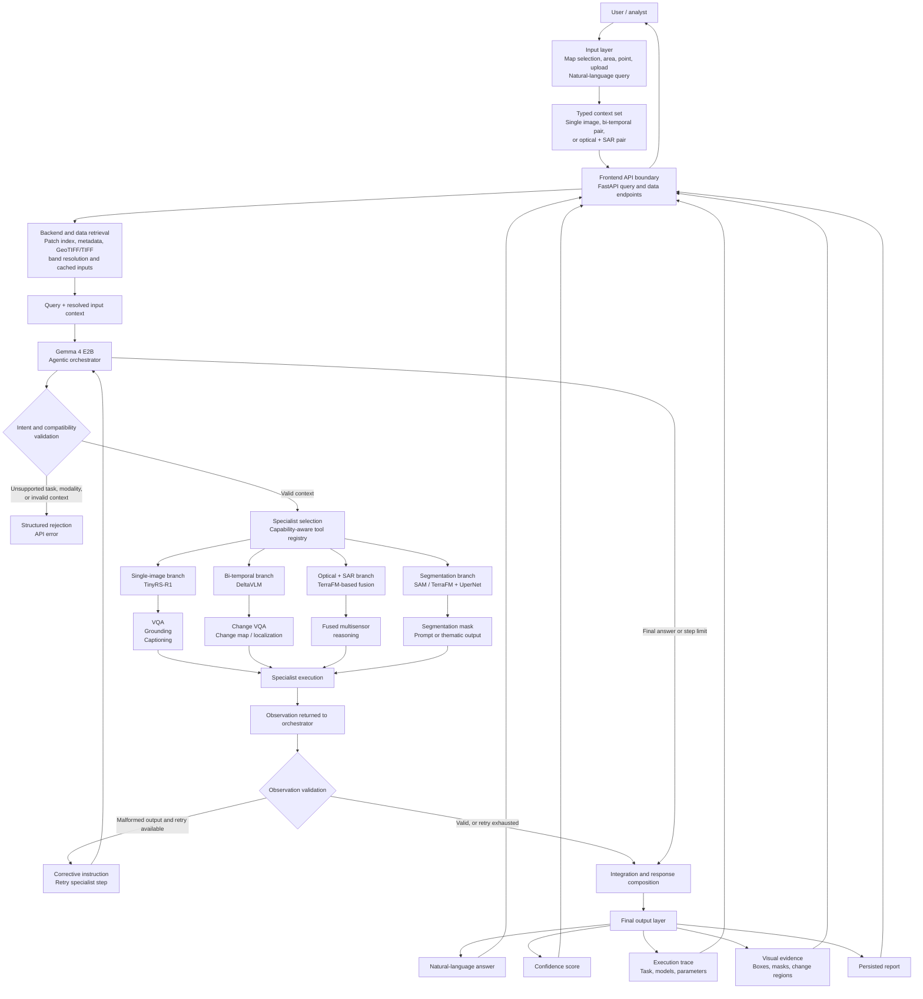
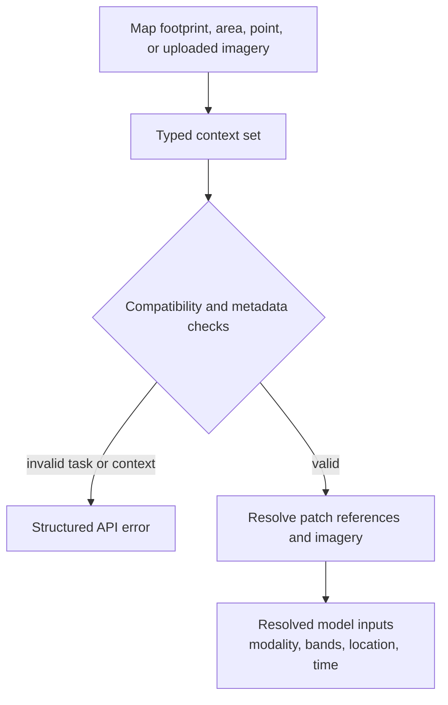
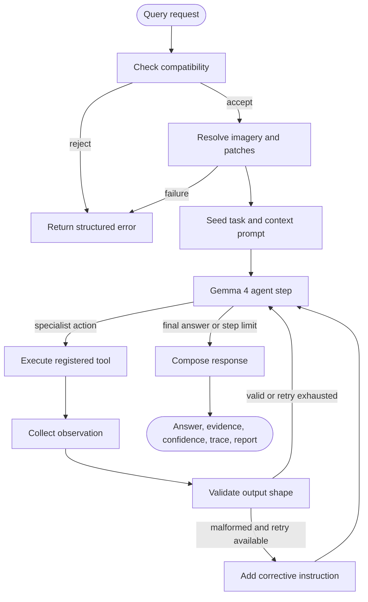
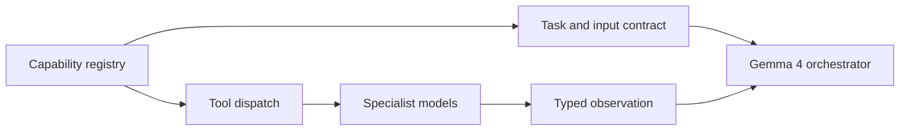
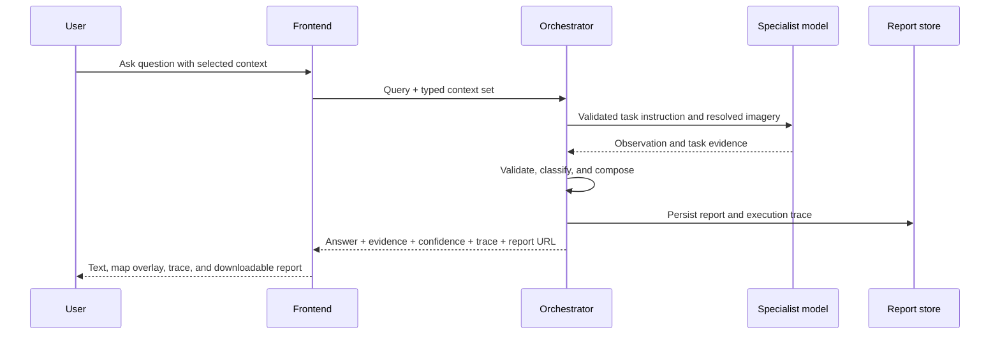

# System Design

SatQuery AI is an evidence-oriented remote-sensing analysis system. A user
selects satellite imagery, asks a natural-language question, and receives an
answer together with the evidence, confidence, specialist models used, and an
auditable execution trace. The system separates orchestration from specialist
Earth-observation models so that each query is routed to the model best suited
to its input context and task.

This document describes the system boundary and runtime behavior. Model
architecture decisions are recorded in [ADR 0001](adr/0001-orchestrator-choice.md)
through [ADR 0005](adr/0005-segmentation-model-choice.md); implementation
details belong in [02-technical-approach.md](02-technical-approach.md).

## 1. End-to-End Architecture

The frontend is a map-and-chat workspace. It sends a typed input context and a
natural-language query to the API; it never invokes a model directly. The
backend retrieves the matching raster inputs, the Gemma 4 E2B agentic
orchestrator validates and routes the request, and the selected specialist
returns an observation for integration into one structured response.

The diagram below is the system's complete flow. Specialist branches are
capability-gated by the model/tool registry: a branch is dispatchable only when
its implementation is registered and marked ready. The branch architecture and
model choices are defined in [ADR 0001](adr/0001-orchestrator-choice.md)
through [ADR 0005](adr/0005-segmentation-model-choice.md).

The architecture has three useful boundaries:

| Boundary | Responsibility |
| --- | --- |
| Frontend/API | Context selection, upload and preview interactions, query transport, session display, map overlays, and report download. |
| Orchestrator | Understand the request, verify that the context is usable, select and sequence tools, validate observations, and compose the response. |
| Specialist layer | Perform domain-specific visual reasoning and return task-shaped observations such as text, coordinates, masks, or change evidence. |

## 2. Inputs And Context

Every query carries a session identifier, natural-language question, and a
typed context set. The context identifies the imagery and its relationship:

| Context | Analysis represented |
| --- | --- |
| `single` | One optical or multispectral scene, optionally with supported SAR bands. |
| `cross_modal_pair` | Co-registered optical and SAR observations of the same area. |
| `bitemporal_pair` | Observations of the same area at two different times. |

Patch footprints and metadata are selected in the map interface. The data
layer resolves those references to the required raster bands, preserves the
spatial metadata needed by downstream models, and provides previews without
making the browser interpret GeoTIFF pixels. Uploads and area selections use
the same context-set boundary, so the rest of the query pipeline receives a
consistent request shape.

Compatibility is checked before model inference. The check covers the context
type, available modalities, spatial relationship between paired images, and
whether the requested task has a registered specialist. This makes unsupported
requests explicit instead of silently substituting a different analysis.

## 3. Orchestrator And Execution Graph

The orchestrator is implemented as a LangGraph `StateGraph`. Its state carries
the query, resolved imagery, conversation messages, tool calls, observations,
retry state, and final answer. The graph is deterministic at the workflow
level even though the main model chooses the next specialist action.

### Runtime stages

1. **Compatibility check:** verifies that the context and requested operation
	 can be handled by the registered specialist layer.
2. **Input resolution:** maps patch references to the relevant optical,
	 multispectral, and/or SAR raster inputs and keeps file-system details out of
	 the model conversation.
3. **Prompt seeding:** gives the main model the user question, spatial and
	 temporal context, available tools, and each tool's required output shape.
4. **Agent step:** the Gemma 4 orchestrator decides whether to call a tool,
	 which tool to call, and how to express the specialist instruction.
5. **Tool execution:** dispatches only to tools marked ready by the registry.
	 Specialist results return to the graph as observations.
6. **Observation validation:** checks that the result matches the requested
	 response shape, including lettered answers and coordinate-bearing grounding
	 results. A bounded corrective retry handles malformed observations.
7. **Answer composition:** converts the final model response and structured
	 observations into the frontend contract, persists the turn, and creates a
	 downloadable report.

## 4. Model And Tool Registry

The registry is the control point between orchestration and inference. A
specialist contributes a capability description, prompt contract, and tool
implementation. The orchestrator exposes only registered, ready capabilities;
future or unavailable tools cannot be selected merely because the main model
mentions them.

The specialist responsibilities follow the architectural decisions:

| Specialist responsibility | Enabled analysis | Decision record |
| --- | --- | --- |
| Single-image optical understanding | Scene captioning, VQA, and spatial grounding. | [ADR 0002](adr/0002-single-image-model-choice.md) |
| Optical-SAR fusion | Joint reasoning over complementary, co-registered sensors. | [ADR 0003](adr/0003-fusion-encoder-choice.md) |
| Bi-temporal change understanding | Change verification, direction, magnitude, comparison, and localization. | [ADR 0004](adr/0004-change-detection-architecture.md) |
| Segmentation | Prompt-based masks and dense thematic land-cover segmentation. | [ADR 0005](adr/0005-segmentation-model-choice.md) |

The orchestrator choice, state transitions, and registry policy are specified
in [ADR 0001](adr/0001-orchestrator-choice.md). This document intentionally
does not repeat the internal encoder, adapter, loss, or training details from
those ADRs.

## 5. Evidence, Confidence, And Trace

SatQuery AI treats an answer as a structured analysis result rather than plain
text. The response can contain:

- **Answer:** the natural-language explanation generated from the specialist
	observation(s).
- **Evidence:** spatial objects such as normalized bounding boxes or masks,
	associated with the relevant patch and label for map visualization.
- **Confidence:** the confidence value exposed by the response contract,
	allowing the interface to communicate how strongly the result is supported.
- **Execution trace:** the classified task, models used, tool-call count, and
	key parameters needed to audit how the answer was produced.
- **Report:** a persisted representation of the query, answer, evidence,
	confidence, and trace for later review or download.

The trace makes the system inspectable: an analyst can see what task was
classified, which specialist participated, and what evidence was returned.
Validation and explicit structured errors prevent malformed or unsupported
results from being presented as ordinary successful answers.

## 6. Related Documentation

- [02-technical-approach.md](02-technical-approach.md): implementation and
	deployment approach.
- [03-models-and-metrics.md](03-models-and-metrics.md): model evaluation and
	measurement plan.
- [04-user-flow.md](04-user-flow.md): analyst interaction flow.
- [09-deployment.md](09-deployment.md): deployment concerns.
- [ADR index](adr/0001-orchestrator-choice.md): authoritative architectural
	decisions.
