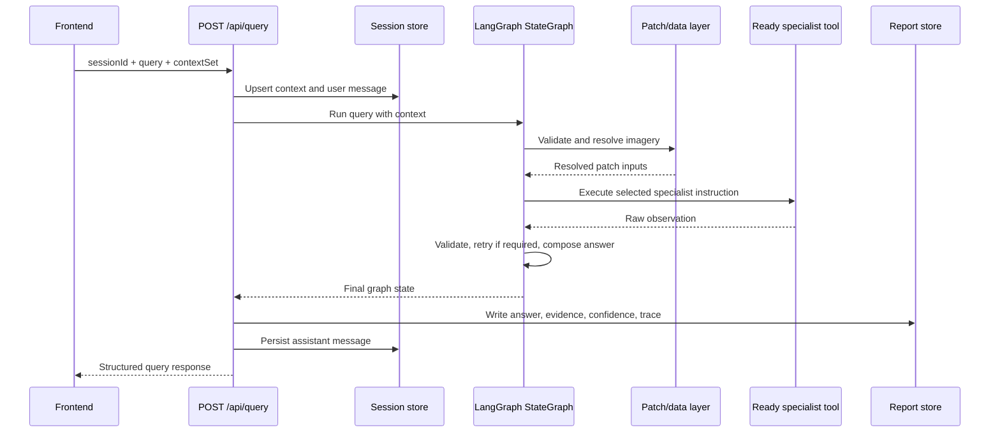
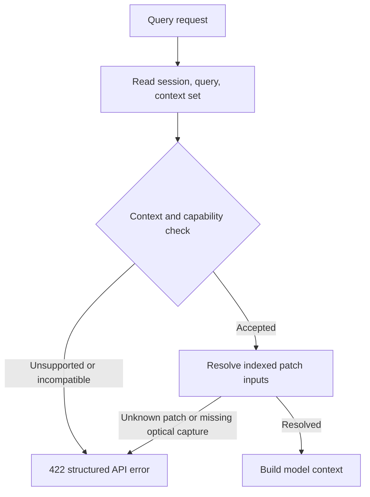
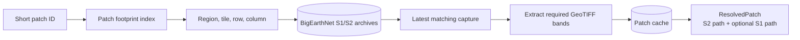
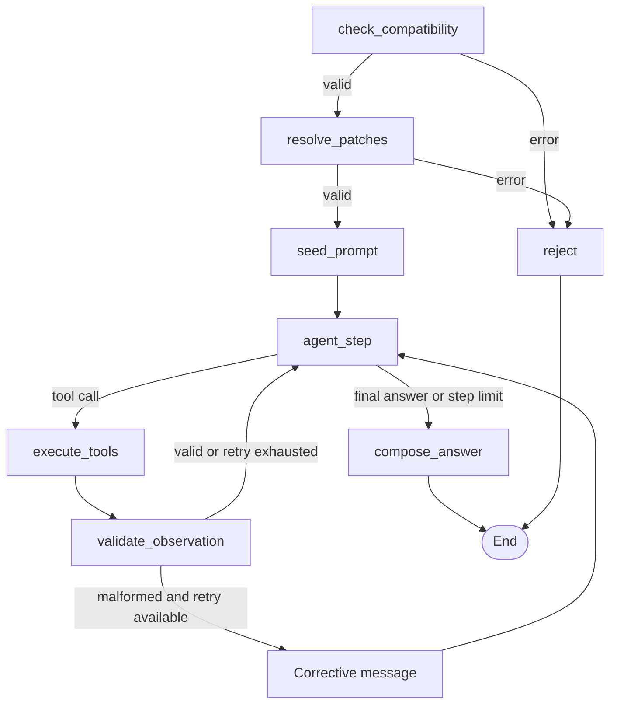
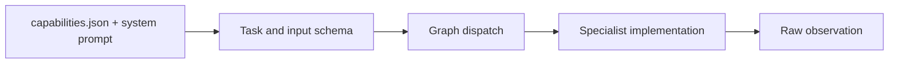
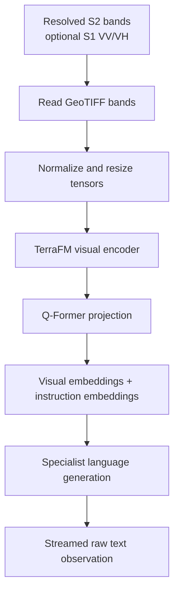
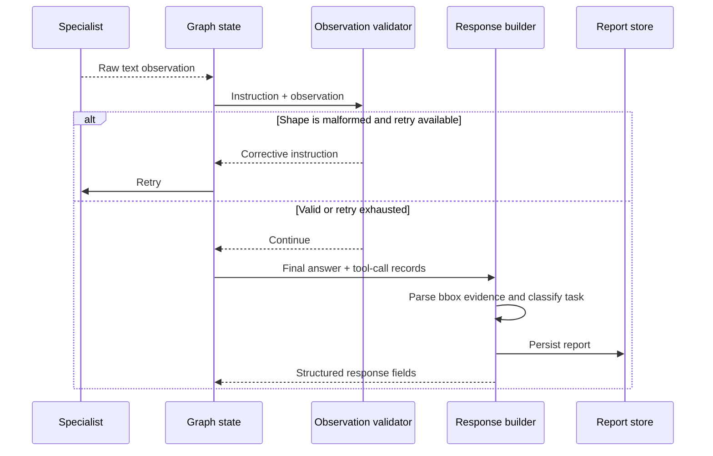

# Technical Approach

SatQuery AI combines a typed imagery context, a FastAPI service boundary, a
LangGraph orchestration loop, and specialist model services. This document
focuses on how a request is processed internally. The system boundary is
described in [01-system-design.md](01-system-design.md); architectural and
model decisions are recorded in [ADR 0001](adr/0001-orchestrator-choice.md)
through [ADR 0005](adr/0005-segmentation-model-choice.md).

## 1. Request Processing Path

The main request enters through `POST /api/query`. The route persists the user
message and context set, invokes the compiled graph, converts its final state
to the response contract, persists the assistant message, and publishes the
completion event. Model-specific logic stays behind the graph and tool
boundaries.

## 2. Input Contract And Validation

The frontend submits a `contextSet` that identifies the imagery relationship
and its items. The current context types are `single`, `bitemporal_pair`, and
`cross_modal_pair`. Items may refer to indexed patches, area selections, or
uploads. The API stores the submitted context before inference so that the
session remains inspectable even when a request is rejected.

The authoritative pre-flight check is
`app/compatibility.py::check_query_compatible`. It runs before the main model
is invoked and returns the API's structured error shape when:

- no ready registry tool supports the requested context type;
- a query refers to an uploaded image that is storable and previewable but not
	connected to the current specialist input path; or
- a patch requests SAR alone even though the ready single-image specialist
	requires optical input and accepts SAR only as an additional modality.

This is a capability check, not a language-model guess. It prevents an
unsupported task from being converted into an apparently valid answer.

## 3. Patch Resolution And Raster Preparation

The patch layer separates user-facing patch identifiers from archive layout.
The footprint index loads the repository's patch fixture records and maps a
short patch ID to region, tile, row, column, location, available modalities,
and capture dates. The resolver then scans the BigEarthNet archive indexes for
the matching optical capture and, when requested, the SAR capture.

Only the selected bands are extracted from the archive into the orchestrator
cache. Extraction is skipped when the target file is already present. The
resulting `ResolvedPatch` contains the optical and optional SAR directories,
the full archive patch IDs, and the paths passed to the specialist service.

For the ready single-image path, optical bands are always required. The
optional SAR path adds `VV` and `VH` bands when the context requests full
bands; it does not turn an SAR-only context into a supported query. Preview
generation uses the same resolved source and can render true-colour,
false-colour, or SAR composites without sending those preview pixels through
the browser.

## 4. Prompt Construction And Task Interpretation

The main model receives operational context, not raw filesystem paths. The
prompt builder includes the resolved patch IDs and available modalities, the
mission rules, and the system prompt of every ready tool. This constrains the
agent to patch IDs supplied for the current turn and to the output shapes that
the selected specialist understands.

For the local Gemma 4 path, the ready tool schemas are rendered into a
structured JSON action format. The graph parses one action into a typed tool
call or a final answer. The graph owns this translation so the tool
implementation can receive resolved files as a normal function argument while
the model sees only its public `patch_id` and `instruction` contract.

The ready single-image specialist defines four instruction shapes:

| Shape | Internal result used by the response builder |
| --- | --- |
| Scene caption | Natural-language scene description. |
| Binary question | Direct yes/no visual answer. |
| Lettered MCQ | VQA answer with a lettered choice. |
| Point/reference grounding | Coordinate-bearing bounding-box answer. |

The detailed prompt contract is kept with the specialist under
`orchestrator/system_prompts/` and its model decision is in [ADR 0002](adr/0002-single-image-model-choice.md).

## 5. LangGraph Orchestration

`app/graph.py` compiles one `StateGraph` and supplies per-request state at
invocation time. The state contains the query, context, resolved patches,
messages, tool-call records, step count, malformed-output retry count, error,
and final answer.

The graph's control decisions are deliberately separate from model output:

1. `check_compatibility` rejects unsupported context before inference.
2. `resolve_patches` supplies actual raster locations to the tool call.
3. `seed_prompt` creates the system and user messages for the turn.
4. `agent_step` asks Gemma 4 to select a ready tool or provide a final answer.
5. `execute_tools` dispatches registered implementations and records raw
	 observations.
6. `validate_observation` checks output shape and adds one corrective nudge for
	 malformed MCQ or grounding results when a retry is available.
7. `compose_answer` selects the last non-tool-call answer and ends the graph.

The graph also has a bounded step count. This prevents a model that continues
to request actions from holding a request open indefinitely.

## 6. Capability Registry And Specialist Execution

The registry reads each specialist's `capabilities.json`. Every specialist is
described by an executable capability contract, system prompt, input schema,
and implementation in `tools/registry.py`. The graph uses the registry to
dispatch EOCaptioner, DeltaVLM, TerraFM fusion, and segmentation pipelines
according to the validated context and task intent.

### Specialist execution pipelines

`run_eocaptioner` verifies that the requested patch was resolved and contains
optical input, builds a request with the optical directory, optional SAR
directory, archive patch ID, and templated instruction, then calls the
specialist service. Expected service failures are returned as an `ERROR:`
observation so the graph can handle them as part of the conversation rather
than losing the whole request to an unstructured exception.

Inside the offline specialist server, the implementation loads the configured
optical bands and optional SAR bands from GeoTIFF files, normalizes and resizes
them, extracts TerraFM visual tokens, projects them through the Q-Former
projector, concatenates the resulting visual embeddings with tokenized text,
and streams the language-model answer. The model bundle is local to the
specialist service; the orchestrator communicates through its HTTP generation
endpoint.

The specialist execution paths share the same registry, orchestration, and
observation-validation boundaries:

| Task path | Architectural implementation | Integrated execution path |
| --- | --- | --- |
| Bi-temporal change understanding | DeltaVLM / BiTemporal v2 with TerraFM features, DeltaBlock, TCSSM, projector, and TinyRS-R1 decoder. | Receives a validated image pair and question, produces temporal observations, and returns change answers and spatial evidence. See [ADR 0004](adr/0004-change-detection-architecture.md). |
| Optical-SAR fusion | Dual-branch TerraFM representation with gated cross-attention and language alignment. | Receives co-registered optical-SAR inputs, produces a fused representation, and returns multisensor reasoning. See [ADR 0003](adr/0003-fusion-encoder-choice.md). |
| Prompt or thematic segmentation | SAM prompt masking and TerraFM-UperNet LULC segmentation. | Receives point, box, or thematic segmentation instructions and returns masks, polygons, and land-cover outputs. See [ADR 0005](adr/0005-segmentation-model-choice.md). |

The internal architectures, training choices, and rationale remain in those
ADRs rather than being duplicated here.

## 7. Observation Validation And Output Integration

The validation node examines the relationship between the instruction shape
and raw observation. An MCQ instruction is expected to produce a lettered
answer; a point/reference grounding instruction is expected to produce
coordinate-shaped output. A malformed result receives one corrective prompt;
after the retry limit, the graph proceeds without claiming that the raw shape
was valid.

`response_builder.py` then performs the output integration:

- classifies the task from the final specialist instruction;
- extracts coordinate-shaped grounding results into structured bounding-box
	evidence linked to the patch ID;
- records ready model metadata and tool-call count in `executionTrace`;
- returns the answer, evidence, confidence, trace, and report URL in the API
	response shape; and
- writes the same information to a JSON report for later download.

The response integration preserves the evidence and confidence signals
returned by specialist execution and presents them with the final answer and
trace in the frontend response contract.

## 8. Adjacent API Paths

Imagery operations are integrated through the API boundary according to their
interaction mode:

- `POST /api/uploads` stores an uploaded file, detects available metadata, and
	serves a preview for subsequent analysis.
- Patch preview endpoints resolve imagery and render server-side composites.
- `POST /api/segment` is a direct UI path for prompt-based segmentation and
	returns the resulting polygon mask for map interaction.
- Session and report endpoints expose persisted context, messages, and
	response artifacts.

This separation keeps interactive map operations and model-orchestrated
questions from being confused with one another.
