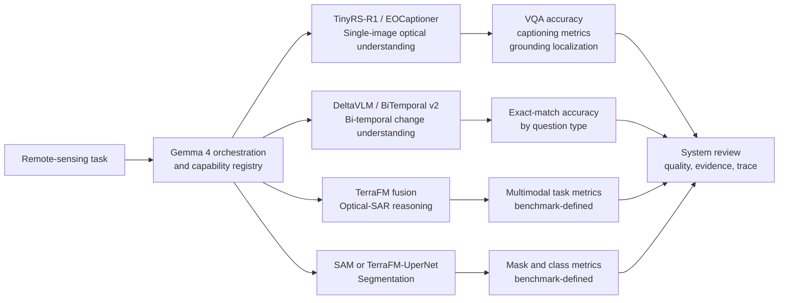
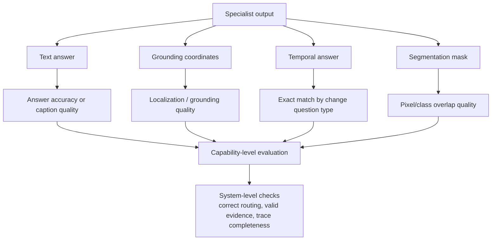

# Models and Metrics

SatQuery AI is evaluated as a set of task-specific Earth-observation models,
not as one undifferentiated language model. Each specialist has a different
input relationship, output contract, and appropriate evaluation signal. The
orchestrator adds system-level checks for routing, malformed observations,
evidence extraction, and trace completeness.

The chosen architectures and their rationale remain in [ADR 0002](adr/0002-single-image-model-choice.md),
[ADR 0003](adr/0003-fusion-encoder-choice.md), [ADR 0004](adr/0004-change-detection-architecture.md),
and [ADR 0005](adr/0005-segmentation-model-choice.md). This document records
their evaluation roles and the metrics evidenced by the repository.

## 1. Model-to-Task Map

The registry currently exposes the single-image EOCaptioner tool as ready. The
change-detection, cross-modal-fusion, and segmentation entries are retained as
capability specifications but are not currently dispatchable. Their metrics
are therefore evaluation targets for their integration stage, not results of
the present API build.

## 2. Specialist Overview

| Specialist / model | Role | Input | Output | Task | Efficiency characteristics |
| --- | --- | --- | --- | --- | --- |
| **EOCaptioner** with TerraFM visual encoder and projected language model | Ready single-image specialist; its capability contract is `vqa_captioning_grounding`. | One indexed optical/multispectral patch; optional SAR bands can accompany optical input. | Text answer or normalized coordinate-shaped grounding response. | VQA, scene captioning, and spatial grounding. | Offline bundle, local inference service, streamed generation, and lazy patch-band extraction. |
| **TinyRS-R1** | Chosen single-image optical VLM and language decoder used by the EOCaptioner and temporal workstream. | Optical or multispectral satellite imagery plus a structured task instruction. | Natural-language answer or normalized bounding box. | VQA, captioning, and grounding. | Qwen2-VL-2B basis; 4-bit NF4 quantization is specified in ADR 0002. |
| **DeltaVLM / BiTemporal v2** | Chosen temporal specialist. | Two aligned RGB satellite images at $t_1$ and $t_2$ plus a change question. | Change answer; the architecture targets change localization/evidence. | Change verification, increase/decrease, transition, ratio, severity, largest-change, and smallest-change questions. | Frozen TerraFM backbone, parameter-efficient LoRA adaptation, and a compact trainable temporal path. |
| **TerraFM dual-branch fusion** | Chosen optical-SAR fusion architecture. | Co-registered optical/multispectral and SAR imagery. | Fused multisensor representation and language-grounded answer. | Joint optical-SAR reasoning and grounding. | Frozen modality branches, gated cross-attention, Perceiver alignment, and LoRA-based language adaptation are specified in ADR 0003. |
| **SAM prompt segmentation** | Chosen direct interactive segmentation tier. | User point or box prompt over an image. | Binary mask or polygon/GeoJSON representation. | Class-agnostic feature delineation. | Prompt-based path is decoupled from agent reasoning for interactive use; the repository endpoint currently reports the model as not integrated. |
| **TerraFM + UperNet** | Chosen thematic segmentation tier. | Multisensor optical/SAR raster inputs. | Dense land-cover mask and class statistics. | CORINE-style LULC semantic segmentation. | Multiscale feature parsing and a dedicated segmentation head; the registry entry is not ready in the current build. |

The names **TinyRS-R1**, **TerraFM**, **DeltaVLM**, **SAM**, and **UperNet**
describe selected model roles. Detailed internal architecture, training
rationale, and parameter choices belong to the corresponding ADRs rather than
this overview.

## 3. Evaluation Evidence In The Repository

### 3.1 BiTemporal v2 evaluation

The temporal workstream contains the most complete project-local evaluation
implementation. `BiTemporal/src/evaluate.py`:

1. loads a validation Parquet file and image annotations;
2. creates a stratified sample by question type;
3. loads the trained temporal checkpoint and TinyRS-R1 LoRA adapter;
4. generates answers with deterministic decoding;
5. extracts the predicted answer from the generated text; and
6. reports overall and per-question-type exact-match accuracy.

The repository README records the final evaluation as a balanced set of 400
examples, 50 per question type:

| Result recorded in `BiTemporal/readme.md` | Value |
| --- | ---: |
| Overall correct | 233 / 400 |
| Overall exact-match accuracy | 58.25% |
| `change_or_not` | 42 / 50 (84%) |
| `decrease_or_not` | 41 / 50 (82%) |
| `increase_or_not` | 40 / 50 (80%) |
| `change_ratio_types` | 36 / 50 (72%) |
| `change_to_what` | 30 / 50 (60%) |
| `largest_change` | 20 / 50 (40%) |
| `change_ratio` | 13 / 50 (26%) |
| `smallest_change` | 11 / 50 (22%) |

These are repository-recorded results, not a claim of a newly reproduced run
in this documentation pass. The distribution is useful because it shows why a
single aggregate number is insufficient: directional questions are materially
different from quantitative ratio and cross-candidate comparison questions.

### 3.2 Temporal implementation checks

The temporal workstream also includes focused tests:

| Check | What it verifies |
| --- | --- |
| `test_forward.py` | Tensor flow through TerraFM, DeltaBlock, TCSSM, FusionProjector, and the language-model input path. |
| `test_backward.py` | Gradients reach DeltaBlock, TCSSM, FusionProjector, and LoRA adapters while TerraFM remains frozen. |
| `test_optimizer.py` | An optimizer step changes a trainable projector parameter. |

These are implementation checks, not task-accuracy metrics. They establish
that the intended trainable/frozen boundary and forward path are functioning.

### 3.3 Single-image evaluation references

ADR 0002 associates TinyRS-R1 with **VRSBench** and **RSVQA**. They cover the
three relevant single-image abilities in different ways:

| Benchmark | Capability relationship | Metric status in this repository |
| --- | --- | --- |
| VRSBench | Remote-sensing VQA, detailed captioning, and object grounding. | Referenced as the chosen benchmark; no local score-generation script or result table is present. |
| RSVQA | Remote-sensing VQA including presence/absence, counting, and comparison. | Referenced as the chosen benchmark; no local score-generation script or result table is present. |

The project should report the benchmark-native task metrics when a reproducible
TinyRS-R1 evaluation harness is connected. This document intentionally does
not assign scores or introduce a metric implementation absent from the repo.

### 3.4 Fusion and segmentation evaluation

ADR 0003 identifies BigEarthNet-style paired Sentinel-1/Sentinel-2 data and
CROMA as a representation-quality comparison. ADR 0005 identifies CORINE
Land Cover for thematic segmentation and SAM for prompt-based masks. The
repository contains their architectural decisions and capability contracts,
but not an active end-to-end fusion or segmentation evaluation script.

Accordingly, the current evidence is:

| Specialist | Evaluation basis currently available | What is not claimed |
| --- | --- | --- |
| TerraFM fusion | Paired optical-SAR task definition and ADR references. | No fusion accuracy or benchmark score is claimed. |
| SAM prompt segmentation | Direct API contract and selected architecture. | No mask quality, IoU, or latency result is claimed. |
| TerraFM-UperNet | CORINE task and selected architecture. | No class-wise segmentation result is claimed. |

## 4. How Metrics Relate To System Capability

Different outputs require different measurements:

- **Classification and VQA accuracy** measures whether the answer matches the
	reference response; it is the metric implemented for BiTemporal v2.
- **Captioning quality** must evaluate generated descriptions against reference
	captions using the selected benchmark's protocol; no local caption score is
	currently recorded.
- **Grounding quality** must compare predicted coordinates with reference
	regions using the selected benchmark's protocol; the API currently parses
	normalized boxes into evidence but does not calculate a grounding score.
- **Change VQA exact match** is especially informative when reported by the
	eight question categories, because qualitative direction and quantitative
	comparison are different capabilities.
- **Segmentation quality** concerns spatial overlap and class correctness,
	while the current repository has no active mask-evaluation implementation.
- **System metrics** complement model metrics: compatibility rejection should be
	explicit, malformed outputs should follow the bounded retry path, evidence
	should be structurally valid, and traces should identify the actual models
	and tool calls.

## 5. Evaluation Plan And Limits

The evidence supports a staged evaluation strategy:

1. Run the specialist's own task benchmark with a fixed, documented split and
	 deterministic configuration.
2. Report results by task subtype, not only as one aggregate number.
3. Run implementation checks for tensor shapes, trainable/frozen boundaries,
	 checkpoint loading, and optimizer updates.
4. Exercise the API graph with supported and rejected contexts to verify routing,
	 error contracts, retry behavior, evidence extraction, and trace generation.
5. Add fusion and segmentation metrics only when their real tool
	 implementations and evaluation datasets are integrated.

No benchmark result should be interpreted as evidence that an unregistered
specialist is available through the production query API.

## 6. Related Documentation

- [01-system-design.md](01-system-design.md): system-level architecture.
- [02-technical-approach.md](02-technical-approach.md): internal execution path.
- [05-datasets.md](05-datasets.md): dataset inventory and provenance.
- [ADR 0002](adr/0002-single-image-model-choice.md) through [ADR 0005](adr/0005-segmentation-model-choice.md): model decisions.
