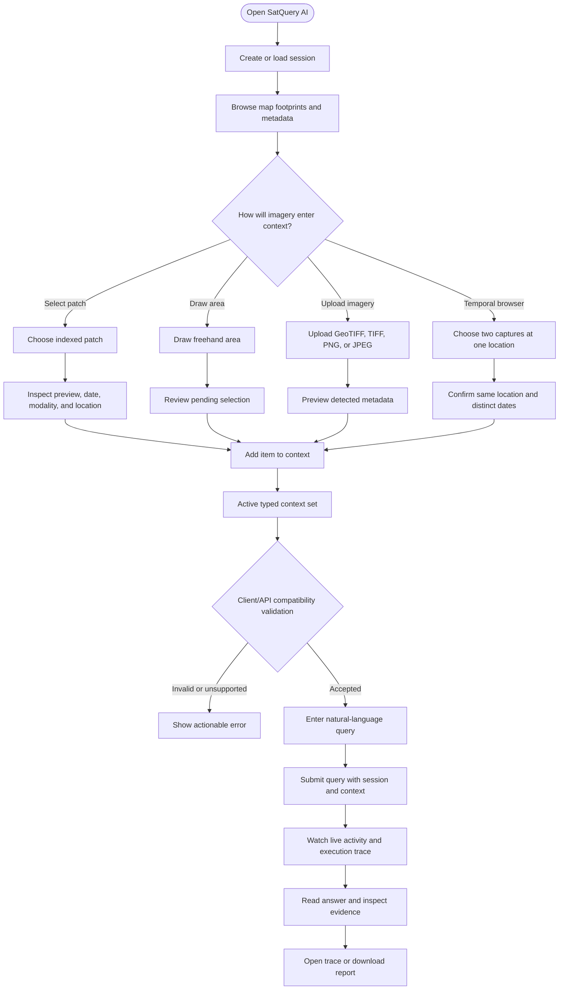
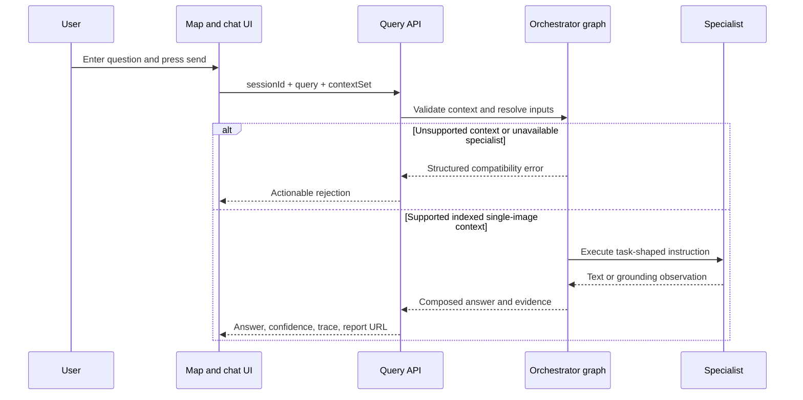
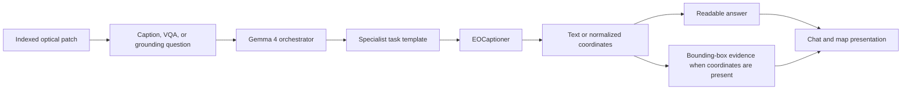
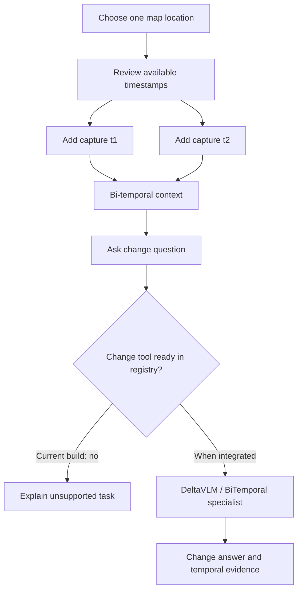
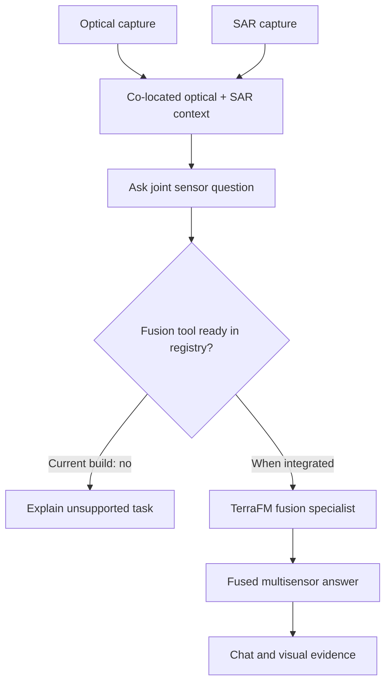
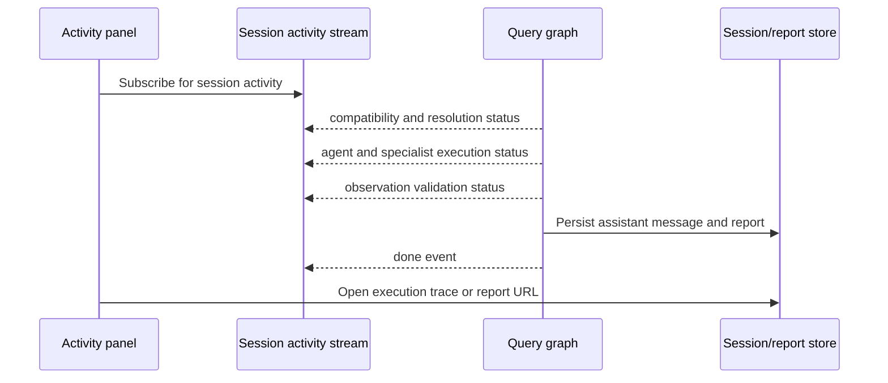

# User Flow

SatQuery AI presents satellite analysis as a map-and-chat workflow. The user
first builds an explicit imagery context, then asks a natural-language
question against that context. The interface shows progress while the request
is processed and returns text together with any available spatial evidence,
confidence, execution trace, and report link.

The frontend contract and interaction design are defined in [ui/DESIGN.md](../ui/DESIGN.md).
The internal processing path is documented in [02-technical-approach.md](02-technical-approach.md).

## 1. End-to-End Journey

The context is never implicit: a query is submitted with the active context
set, and the user can remove or replace its items before sending.

## 2. Build The Imagery Context

### Select an indexed patch

The map displays patch footprints returned by the backend. Selecting a
footprint opens metadata such as patch ID, label, location, available
modalities, and capture dates. The user can inspect a server-rendered
true-colour, false-colour, or SAR preview before adding the patch to context.

The map basemap is for geographic orientation. The selected footprint is the
actual dataset reference that the backend resolves to raster files.

### Draw an area

Free draw creates a user-authored polygon on the map. The frontend checks which
known footprints it overlaps and shows the resulting patch count before the
user confirms it. Area selections are limited to a `single` context set in the
current interaction contract because pairing an arbitrary shape across dates or
modalities is not yet defined.

### Upload imagery

The upload dialog accepts the formats supported by the API upload route:
GeoTIFF/TIFF and common PNG/JPEG image files. The user sees upload progress,
then a pending card with the returned preview, detected modality, location,
timestamp, and filename. Missing metadata can be completed in the context
workflow before confirmation.

The current backend stores uploads and serves previews, but the authoritative
query compatibility check does not yet allow uploaded imagery to be sent to the
ready specialist. The user therefore receives an explicit incompatibility
message rather than an answer generated from unsupported input.

### Prepare a pair

The context manager supports two-image sets:

| Context | User action | Current query outcome |
| --- | --- | --- |
| `single` | Add one indexed patch, area selection, or upload. | Indexed patch queries can proceed through the ready single-image specialist; uploads are stored/previewable but rejected for querying. |
| `bitemporal_pair` | Select two captures at the same location with different timestamps. | The UI and API contracts represent the flow, but the current registry has no ready change-detection tool, so the query is rejected as unsupported. |
| `cross_modal_pair` | Provide co-located optical and SAR imagery. | The context shape is defined, but the current registry has no ready fusion tool, so the query is rejected as unsupported. |

The UI prevents unrelated patches from being silently combined into a pair and
keeps area selections out of pair contexts. These checks improve the quality
of the request before the user reaches the submit step.

## 3. Query Submission

Once a context is valid, the user enters a question such as:

- “Describe the land cover in this patch.”
- “Is there a water body in this image?”
- “Locate the built-up area near this point.”
- “What changed between these two dates?”
- “Use the optical and SAR images together to identify built-up regions.”

The prompt is sent with the active session and context set. There is no
no-image query mode in the current contract.

## 4. Single-Image Flow Available Now

For an indexed single patch, the user experience is:

1. Select a patch and choose the default optical view or full optical-plus-SAR
   bands.
2. Ask a VQA, captioning, or grounding question.
3. The orchestrator selects the ready EOCaptioner tool and formats the
   instruction into the specialist's supported shape.
4. The specialist returns text or normalized bounding-box coordinates.
5. The interface displays the answer; coordinate output becomes visual bbox
   evidence linked to the patch.

The user does not need to know archive paths or model-specific prompt syntax;
those are handled behind the API and specialist contract.

## 5. Bi-Temporal Flow

The intended user journey is to open the temporal browser, choose two captures
for one location, select a change question, and submit the pair. The context
and UI affordances exist for this workflow, and the BiTemporal specialist is
implemented and evaluated in its own workstream. However, the orchestrator's
current capability registry marks the change-detection tool as not ready.

The user-facing behavior for the current build is an explicit structured
rejection. It does not fabricate a change map or route the pair through the
single-image model.

## 6. Optical-SAR Flow

The intended cross-modal journey is to provide co-located optical and SAR
imagery, choose a fusion question, and inspect a fused answer. The context
contract and the TerraFM fusion decision are documented, but the fusion tool is
not currently ready in the registry.

The current ready single-image path can accept optional SAR alongside optical
bands, but it does not constitute the separate cross-modal fusion capability.
SAR-only input is rejected because the ready specialist requires optical input.

## 7. Progress, Trace, And Results

While a supported query runs, the frontend can subscribe to the session
activity stream. The backend reports meaningful stages such as compatibility
checking, patch resolution, agent steps, tool execution, observation results,
validation, and response composition. The same events are logged server-side.

Each successful assistant result can contain:

- natural-language answer;
- spatial evidence when the specialist response contains parseable grounding
  coordinates;
- confidence value from the response contract;
- execution trace with task, models used, and tool-call parameters; and
- a downloadable persisted JSON report.

The current response path does not provide reliable text-span grounding, and a
failed or unsupported operation is shown as an error rather than an apparently
successful visual result.

## 8. Session Continuity

Sessions are created and loaded through the session API. Context sets and chat
messages are persisted in SQLite, allowing the user to return to a previous
analysis. Reports are written when a query completes, so the result shown in a
download remains tied to the answer, evidence, confidence, and trace produced
for that turn.

## 9. Related Documentation

- [01-system-design.md](01-system-design.md): system architecture.
- [02-technical-approach.md](02-technical-approach.md): internal execution and
  data path.
- [05-datasets.md](05-datasets.md): dataset and split responsibilities.
- [ADR 0002](adr/0002-single-image-model-choice.md) through [ADR 0005](adr/0005-segmentation-model-choice.md): specialist decisions.
