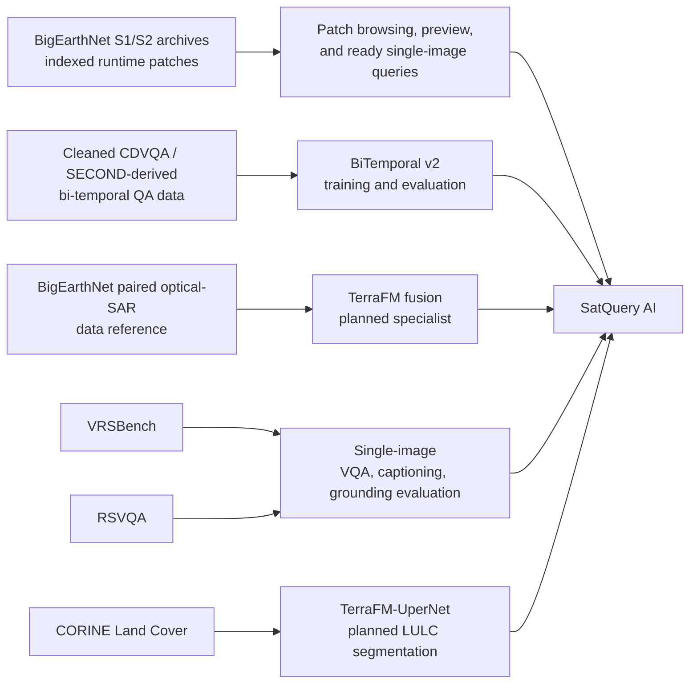
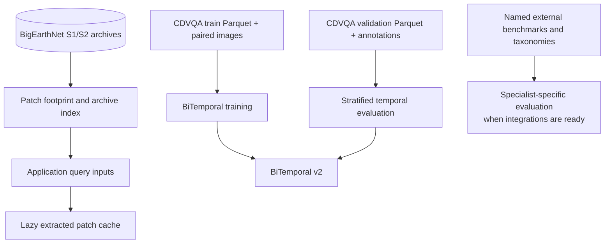

# Datasets

SatQuery AI uses different data sources for runtime imagery, specialist
training, and independent evaluation. They should not be treated as one
dataset: the indexed BigEarthNet archives power the application data path,
while the BiTemporal workstream trains and evaluates a temporal specialist on
its own question-answering data. Other datasets and benchmarks are recorded as
the selected basis for specialist work that is not yet enabled in the tool
registry.

For model and metric interpretation, see [03-models-and-metrics.md](03-models-and-metrics.md).
For implementation details about patch resolution, see [02-technical-approach.md](02-technical-approach.md).

## 1. Dataset-to-Capability Map

## 2. Dataset Comparison

| Dataset / benchmark | Modalities and task coverage | Role in SatQuery AI | Availability in this repository |
| --- | --- | --- | --- |
| **BigEarthNet S1/S2 archives** | Sentinel-2 optical/multispectral and Sentinel-1 SAR patch captures. | Runtime patch lookup, band extraction, previews, and the ready single-image query path. | Four archive names are wired into the patch index: Kosovo S1/S2 and Luxembourg S1/S2. |
| **BigEarthNet paired optical-SAR reference** | Co-registered optical and SAR Earth-observation tiles. | Training/data basis named by ADR 0003 for the TerraFM fusion specialist. | The repository has S1/S2 runtime archives and fusion contracts; a separate fusion training/evaluation harness is not enabled. |
| **CDVQA / SECOND-derived cleaned data** | Two RGB images of the same area at different times, natural-language questions, answers, and eight change question types. | Training and validation for BiTemporal v2 / DeltaVLM. | `BiTemporal/data/` is provisioned outside source control; paths and loaders are implemented. |
| **VRSBench** | Remote-sensing VQA, detailed captioning, and object grounding. | Selected evaluation benchmark for TinyRS-R1 single-image understanding. | Referenced by ADR 0002; no local benchmark runner or project score table is present. |
| **RSVQA** | Remote-sensing VQA covering presence/absence, counting, and comparison. | Additional selected evaluation benchmark for single-image understanding. | Referenced by ADR 0002; no local benchmark runner or project score table is present. |
| **CORINE Land Cover** | Thematic land-cover classes. | Training/taxonomy basis named by ADR 0005 for TerraFM-UperNet semantic segmentation. | Selected in the ADR; no active segmentation training/evaluation path is registered. |

The authoritative project reference list, including source links, is in
[06-references.md](06-references.md). The table above records usage rather
than repeating full dataset citations.

## 3. BigEarthNet Runtime Archives

The application patch index is built around BigEarthNet-style per-band
archives. The repository expects:

| Archive group | Data used |
| --- | --- |
| Kosovo S2 | Sentinel-2 optical/multispectral bands. |
| Kosovo S1 | Sentinel-1 SAR `VV` and `VH` bands. |
| Luxembourg S2 | Sentinel-2 optical/multispectral bands. |
| Luxembourg S1 | Sentinel-1 SAR `VV` and `VH` bands. |

The UI-facing footprint fixtures contain the short patch ID, region, tile,
row, column, coordinates, polygon, available modalities, and capture dates.
The backend scans archive member names by location key, selects the matching
capture, and extracts only the required bands into the patch cache.

For the ready query path:

- optical Sentinel-2 input is required;
- full-band selection may add Sentinel-1 SAR bands;
- SAR-only selection is rejected by compatibility validation; and
- the browser sees rendered previews and footprints rather than reading the
	archive pixels directly.

This is an application data path, not the BiTemporal training split.

## 4. CDVQA / SECOND-Derived BiTemporal Data

The `BiTemporal` workstream loads a cleaned question-answer dataset from
Parquet files and maps question image IDs to paired images using a JSON
annotation file. The repository README records:

| Property | Recorded value |
| --- | ---: |
| Question-answer samples | 65,967 |
| Unique image pairs | 25,563 |
| Complete image filenames used by the workstream | 1,600 |
| Question categories | 8 |
| Image preparation | RGB conversion, resize to $224 \times 224$, ImageNet normalization |

The configuration distinguishes:

- `data/cdvqa_train_clean.parquet` for training;
- `data/cdvqa_val_clean.parquet` for validation/evaluation;
- `data/cdvqa_annotations/Train_images.json` for image-ID to filename
	resolution; and
- `data/second_images/SECOND_train_set` as the image root used by the current
	configuration.

Each loaded sample exposes two images (`im1`, `im2`), the question text,
question type, answer text, and image ID. The eight categories are:

| Question type | Meaning |
| --- | --- |
| `change_or_not` | Whether a change occurred. |
| `increase_or_not` | Whether the queried quantity increased. |
| `decrease_or_not` | Whether the queried quantity decreased. |
| `change_to_what` | What the changed region or object became. |
| `change_ratio` | Quantitative change ratio. |
| `change_ratio_types` | Categorical change magnitude/type. |
| `largest_change` | Candidate with the largest change. |
| `smallest_change` | Candidate with the smallest change. |

The evaluator samples validation examples by question type and reports exact
answer accuracy overall and per category. The recorded results are documented
in [03-models-and-metrics.md](03-models-and-metrics.md); this page only defines
the data used to obtain them.

## 5. Specialist-Specific Data Roles

### Single-image specialist

TinyRS-R1 is selected for optical/multispectral VQA, captioning, and grounding.
VRSBench and RSVQA are the named external evaluation references in [ADR 0002](adr/0002-single-image-model-choice.md).
The current application runtime uses indexed BigEarthNet patches for the ready
EOCaptioner service; uploaded images are stored and previewed but are not yet
accepted by the query compatibility path.

### Optical-SAR fusion

ADR 0003 identifies paired Sentinel-1 and Sentinel-2 data as the basis for
TerraFM dual-branch fusion. The repository's runtime archives provide the
corresponding modality vocabulary and patch pairing structure. The fusion tool
is not currently registry-ready, so no project fusion split or score is
claimed here.

### Bi-temporal change understanding

CDVQA / SECOND-derived data is the concrete training and evaluation source for
BiTemporal v2. The model's question taxonomy and validation sampling are
implemented under `BiTemporal/`.

### Segmentation

ADR 0005 selects SAM for prompt-based masks and TerraFM-UperNet for thematic
land-cover segmentation using CORINE classes. The current segmentation API
contract exists, but normal operation reports that the model is not integrated;
therefore no segmentation dataset split or application result is presented as
active.

## 6. Data Handling And Split Boundaries

Runtime archives and the BiTemporal train/validation data serve different
purposes. The repository does not document a cross-dataset accuracy comparison,
so results should remain within the split and task for which they were
produced.

## 7. Related Documentation

- [02-technical-approach.md](02-technical-approach.md): data resolution and
	preprocessing path.
- [03-models-and-metrics.md](03-models-and-metrics.md): evaluation evidence.
- [04-user-flow.md](04-user-flow.md): how users select and query imagery.
- [06-references.md](06-references.md): dataset and benchmark sources.
- [ADR 0002](adr/0002-single-image-model-choice.md) through [ADR 0005](adr/0005-segmentation-model-choice.md): specialist data decisions.
