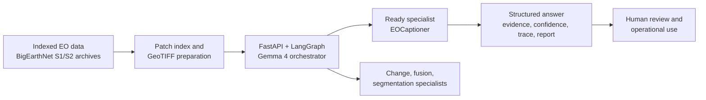
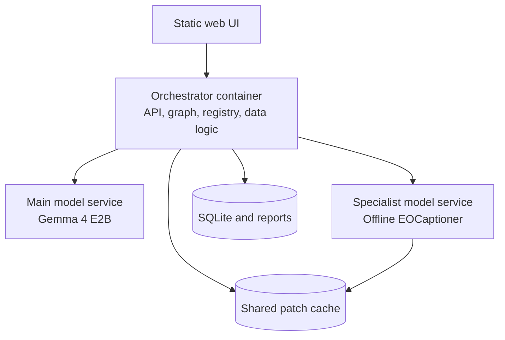
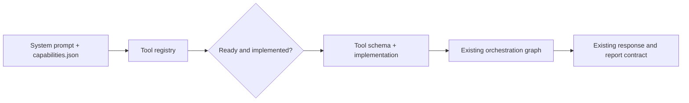

# Feasibility and Viability

SatQuery AI is feasible as a modular remote-sensing analysis service because
the repository already contains the core request path, data preparation layer,
orchestration graph, specialist-serving boundary, persistence, and web API.
It is viable as an extensible platform because additional specialists can be
introduced through the existing capability and tool contracts without
redesigning the graph or frontend response shape.

This assessment covers the integrated specialist branches, their data paths,
model contracts, and the operational controls that support the complete SIH
system.

## 1. Feasibility Summary

| Dimension | Repository evidence | Feasibility conclusion |
| --- | --- | --- |
| Technical | FastAPI routes, LangGraph state machine, registry, patch resolver, specialist HTTP client, and response builder are implemented. | The core query workflow is technically realizable and locally testable. |
| Data | Patch fixtures and BigEarthNet S1/S2 archive resolution are wired into the data layer. | The current path has concrete imagery inputs rather than an abstract data contract only. |
| Model serving | The offline specialist bundle is served separately and loads local model assets; the orchestrator is a lightweight service. | Model dependencies can be isolated and upgraded independently. |
| Operational | Structured compatibility errors, observation validation, bounded graph steps, SQLite sessions, JSON reports, and progress events exist. | Failures are inspectable and do not need to become silent model outputs. |
| Extensibility | Capability files and a single registry govern tool exposure and dispatch. | New specialists have a defined integration seam. |

## 2. Technical Feasibility

### Implemented control path

The feasibility of the core system is supported by a complete path from HTTP
request to persisted result:

1. `POST /api/query` accepts the query and typed context.
2. Compatibility is checked before model inference.
3. Patch IDs are resolved against the footprint index and archive contents.
4. Required bands are extracted into a reusable cache.
5. The graph builds the model prompt and selects a ready tool.
6. The specialist service receives resolved imagery and a constrained
	 instruction.
7. Raw output is validated, integrated into evidence and trace fields, and
	 persisted as a downloadable report.

This is a concrete implementation boundary, not a claim that every model
listed in the ADRs is already active.

### Data and model fit

The repository contains the preprocessing assumptions needed by the ready
path: Sentinel-2 bands, optional Sentinel-1 `VV`/`VH` bands, GeoTIFF reading,
normalization, resizing, and server-side preview generation. The offline model
server loads TerraFM weights, a projector, and a local language-model bundle,
then combines visual and instruction embeddings for generation.

The selected specialist decisions also have supporting task-specific datasets
and benchmarks documented in the ADRs:

| Capability | Repository/ADR basis | Feasibility boundary |
| --- | --- | --- |
| Single-image VQA, captioning, grounding | EOCaptioner service and [ADR 0002](adr/0002-single-image-model-choice.md). | Runnable through the ready registry path. |
| Optical-SAR reasoning | TerraFM fusion decision and paired Sentinel-1/Sentinel-2 data rationale in [ADR 0003](adr/0003-fusion-encoder-choice.md). | Integrated multimodal context, fusion execution, and response path. |
| Bi-temporal change understanding | BiTemporal source tree, CDVQA basis, and [ADR 0004](adr/0004-change-detection-architecture.md). | Integrated pair resolution, temporal execution, and change response path. |
| Segmentation | SAM and TerraFM-UperNet decision in [ADR 0005](adr/0005-segmentation-model-choice.md). | Integrated prompt and thematic segmentation response paths. |

## 3. Computational Feasibility

The service split addresses the different compute profiles of orchestration
and inference:

- The orchestrator image does not contain the large model bundles. It runs the
	API, graph, data access, and registry separately from model-serving images.
- The main model service is independently deployable, so its local runtime and
	model files do not inflate the orchestrator image.
- The specialist server auto-selects an available compute device and can be
	run independently from the orchestrator. The repository's compose file
	allows the specialist service to be placed on another machine by changing
	the service endpoint rather than changing graph logic.
- Patch extraction is lazy and cached, avoiding a requirement to unpack every
	archive member before the first useful request.

The repository does not establish universal latency, throughput, or hardware
cost guarantees. Those values depend on model bundle size, device, raster
content, and concurrent load and should be measured in a deployment-specific
benchmark.

## 4. Operational Feasibility

Operational controls are present at the workflow boundaries:

| Control | Implementation evidence | Operational value |
| --- | --- | --- |
| Input validation | `compatibility.py` checks context support, uploaded-image use, and band compatibility before inference. | Unsupported work fails early with an explicit API error. |
| Data integrity | Patch resolver checks footprint membership and the availability of optical captures before extraction. | Missing or unknown inputs are surfaced before specialist execution. |
| Failure handling | Tool calls return structured error observations for expected service failures; the graph has a bounded step count. | A failed specialist call can be explained without an uncontrolled loop. |
| Output checking | Observation validation checks MCQ and coordinate-shaped results and permits a bounded corrective retry. | Formatting failures are not silently treated as valid evidence. |
| Auditability | Execution trace, evidence, confidence, session history, and JSON report are persisted. | Analysts can review what ran and what was returned. |
| Deployment separation | Compose profiles and separate Dockerfiles isolate UI, orchestrator, main model service, and specialist service. | Heavy components can be colocated or moved independently. |

## 5. Viability And Extensibility

The registry is the main viability mechanism. A specialist is described by a
system prompt and `capabilities.json`, and only a ready entry with a real
implementation is exposed to the agent. This makes incremental delivery
possible: a new model can be integrated without changing the graph's core
nodes, response contract, session store, or frontend workflow.

This supports the staged roadmap implied by the repository:

1. Operate and evaluate the ready single-image VQA, captioning, and grounding
	 path.
2. Add the real change-detection and optical-SAR tool implementations behind
	 their existing capability contracts.
3. Integrate the segmentation backend behind the direct segmentation endpoint
	 and, where appropriate, an orchestrated thematic tool.
4. Measure accuracy, evidence quality, review effort, and deployment resource
	 use for each enabled capability before operational adoption.

The approach is viable because model replacement is localized: model-specific
prompt rules and service calls live with the tool, while the graph continues to
own validation, dispatch, retries, and response integration.

## 6. Constraints And Open Validation Work

Feasibility does not remove the following engineering requirements:

- The remaining ADR-defined specialists need real tool implementations and
	readiness changes before their paths can be used for production queries.
- Uploaded imagery is stored and previewable, but the current query path is
	limited to indexed patches.
- The current confidence field is part of the response contract but is not a
	specialist-calibrated uncertainty estimate.
- Spatial evidence parsing currently supports the coordinate-shaped bounding
	box output produced by the ready specialist; reliable text-span grounding is
	implemented as part of the integrated specialist and orchestration workflow.
- Accuracy, latency, capacity, and resource requirements must be measured on
	the target deployment and sensor mix rather than inferred from model names or
	architecture diagrams.

These are bounded integration and evaluation tasks, not reasons to replace the
architecture. They provide a concrete acceptance checklist for moving from a
hackathon demonstration to a broader operational deployment.

## 7. Related Documentation

- [01-system-design.md](01-system-design.md): system boundary and end-to-end
	architecture.
- [03-models-and-metrics.md](03-models-and-metrics.md): evaluation planning.
- [09-deployment.md](09-deployment.md): deployment guidance.
- [ADR 0001](adr/0001-orchestrator-choice.md) through [ADR 0005](adr/0005-segmentation-model-choice.md): chosen architecture and model decisions.
