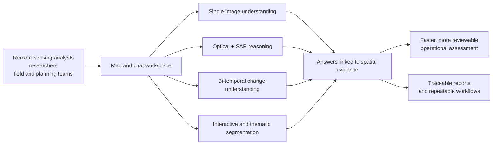

# Impact

SatQuery AI's impact comes from turning several remote-sensing operations into
one evidence-producing workflow: select the relevant imagery, ask a question
in natural language, receive a task-specific analysis, and inspect the
supporting spatial evidence and execution trace. The result is not a generic
chat interface; it is a common operating surface for optical, SAR, temporal,
and land-cover analysis.

The capabilities below are grounded in the system architecture and its model
decisions. See [01-system-design.md](01-system-design.md) for the runtime
pipeline and [02-technical-approach.md](02-technical-approach.md) for
implementation detail.

## 1. Application Impact Map

## 2. Practical Outcomes By User Group

| User group | Practical change enabled by SatQuery AI |
| --- | --- |
| Remote-sensing analyst | Ask VQA, captioning, and grounding questions without manually switching between image viewers, model interfaces, and coordinate tools. |
| Disaster and infrastructure assessment team | Compare observations across dates, identify whether a feature increased or decreased, and locate the area of greatest change. |
| Agriculture, land-use, and environmental team | Combine optical and SAR evidence when cloud, haze, illumination, or surface conditions make a single sensor insufficient; classify land-cover regions and inspect their boundaries. |
| Decision-maker or reviewer | Read a concise answer while opening the associated evidence, confidence, model trace, and downloadable report. |
| Developer or model integrator | Add a specialist through a capability contract and registry entry without redesigning the user workflow or response shape. |

## 3. Remote-Sensing Use Cases

### Single-image interpretation

The single-image specialist supports scene description, binary and multiple-
choice visual questions, and spatial grounding. This helps an analyst move from
"what is visible?" to a locatable answer about a target class or object. The
underlying choice is documented in [ADR 0002](adr/0002-single-image-model-choice.md).

### Optical-SAR assessment

Optical and SAR observations provide complementary signals. Their joint path
supports assessment of built-up areas, water-covered regions, surface
structure, and moisture-related patterns when optical evidence alone is
ambiguous. The fusion design and its reliability motivation are recorded in
[ADR 0003](adr/0003-fusion-encoder-choice.md).

### Bi-temporal change analysis

The temporal path turns two observations into question-focused change
understanding. It can address whether change occurred, whether a queried class
increased or decreased, what the transition was, how large or severe it was,
and which candidate region changed most or least. This supports monitoring of
urban expansion, land-cover transitions, environmental disturbance, and
infrastructure evolution. See [ADR 0004](adr/0004-change-detection-architecture.md).

### Segmentation and land-cover mapping

Segmentation provides two complementary outputs: prompt-based delineation of a
user-selected feature and dense thematic land-cover regions. This makes the
system useful both for a quick map interaction and for structured land-cover
assessment. The two-tier design is described in [ADR 0005](adr/0005-segmentation-model-choice.md).

## 4. Impact Dimensions

| Dimension | Concrete effect |
| --- | --- |
| Accessibility | Natural-language task instructions expose specialist remote-sensing analysis to users who do not need to configure each model independently. |
| Workflow efficiency | Context selection, imagery preparation, model routing, validation, and report generation occur in one workflow. |
| Multimodal understanding | Complementary optical, multispectral, SAR, and temporal evidence can be used according to the question rather than treated as interchangeable images. |
| Analytical accuracy | Task-specific models and explicit observation validation reduce the need to interpret raw or malformed model output manually. |
| Decision support | Answers can include spatial evidence, confidence, and a trace, making important observations easier to inspect before action. |
| Repeatability | Typed contexts, specialist prompt contracts, persisted sessions, and downloadable reports make an analysis easier to revisit and compare. |

## 5. Evidence Of Value

The system makes impact observable through workflow and response artifacts rather
than broad claims:

- **Time to analysis:** compare the time from context selection to a usable
	answer against a multi-tool manual workflow.
- **Review effort:** measure how quickly a reviewer can verify an answer using
	its evidence and execution trace.
- **Task coverage:** track successful VQA, captioning, grounding, fusion,
	change, and segmentation tasks by context type.
- **Spatial usefulness:** assess whether returned boxes, masks, and change
	regions identify the intended feature or area.
- **Repeatability:** rerun equivalent contexts and compare the structured
	output, trace, and report artifacts.

These measures are deliberately tied to the product's actual workflow. They
can be reported alongside model metrics in
[03-models-and-metrics.md](03-models-and-metrics.md), without treating a
language answer alone as proof of remote-sensing accuracy.

## 6. Responsible Interpretation

SatQuery AI is decision support. Its outputs should be reviewed against the
imagery, metadata, and operational context, especially where observations are
affected by registration quality, cloud or atmospheric conditions, sensor
differences, or ambiguous scene content. The system makes that review practical
by exposing evidence, confidence, validation outcomes, and a trace instead of
presenting an unexplained conclusion.
