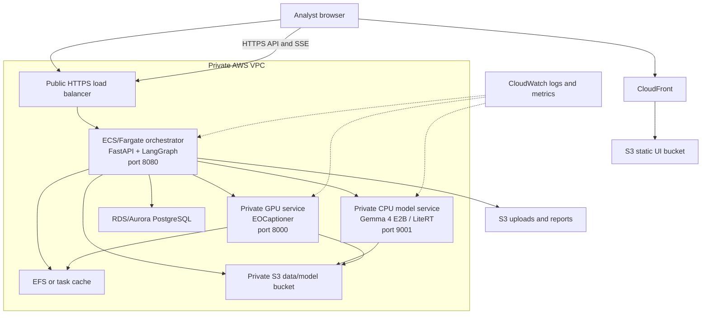
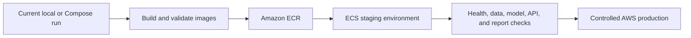

# Deployment

The repository supports local native processes and Docker Compose. This document
defines the AWS deployment plan derived from the existing UI, orchestrator,
model services, ports, storage paths, and API contracts.

See [01-system-design.md](01-system-design.md) for the system architecture,
[02-technical-approach.md](02-technical-approach.md) for internal service
behavior, and [10-getting-started.md](10-getting-started.md) for local setup.

## 1. Components And AWS Placement Plan

| Repository component | Current local form | AWS placement plan |
| --- | --- | --- |
| React/Vite UI | Vite development server or static `ui` container on port 80. | Amazon S3 static bucket behind Amazon CloudFront. |
| FastAPI orchestrator | Process/container on port 8080. | Amazon ECS service on Fargate behind an Application Load Balancer. |
| Gemma 4 E2B service | LiteRT server on port 9001 with a mounted model file. | Private ECS CPU service with model artifacts staged from S3. |
| EOCaptioner specialist | `server/serve.py` on port 8000; TerraFM plus language model bundle. | Private GPU-capable ECS/EC2 service behind internal service discovery. |
| BigEarthNet archives | ZIP files mounted locally. | Private Amazon S3 data bucket. |
| Patch cache | Docker named volume shared by orchestrator and specialist. | Amazon EFS shared mount or rebuildable task-local cache. |
| SQLite sessions and messages | Local SQLite file. | Amazon RDS/Aurora PostgreSQL for multi-instance operation. |
| Uploads and reports | Local directories under `data_store`. | Private S3 prefixes with protected download access. |
| Activity feed | In-process status bus and SSE endpoint. | SSE through the API load balancer with shared event delivery for scaled replicas. |

## 2. AWS Target Architecture

The model services remain private. Only CloudFront and the API load
balancer are public entry points. The orchestrator calls model services over
private networking and security-group rules.

## 3. Service Interfaces

| Service | Responsibility | Interface |
| --- | --- | --- |
| CloudFront + S3 | Deliver the compiled frontend. | HTTPS to browser; API configured as a separate origin. |
| Application Load Balancer | TLS termination and API routing. | Public HTTPS 443 to ECS target port 8080. |
| ECS orchestrator | Context validation, patch resolution, graph execution, tool calls, reports, and sessions. | Existing FastAPI routes on port 8080. |
| Main-model service | Respond to orchestrator model requests. | Existing LiteRT HTTP service on port 9001. |
| Specialist service | Run EOCaptioner generation. | Existing generation service on port 8000. |
| RDS/Aurora PostgreSQL | Durable sessions, messages, context sets, and trace metadata. | Private database endpoint. |
| S3 | Archives, model bundles, uploads, reports, and versioned artifacts. | Private AWS SDK access. |
| EFS or local cache | Preserve the current shared extracted-band assumption where required. | Mounted filesystem. |
| CloudWatch | Central logs, health signals, and resource metrics. | AWS service integration. |

The deployment preserves the current shared absolute patch-cache contract with
EFS or an equivalent shared volume. If object references are used, the tool
boundary passes those references explicitly. S3 is not itself a
drop-in replacement for a shared mounted directory.

## 4. Configuration Plan

Configuration is centralized in `orchestrator/app/config.py` and supplied by
environment variables. The AWS deployment maps it as follows:

| Variable | Current meaning | AWS value or handling |
| --- | --- | --- |
| `ORCHESTRATOR_PORT` | API listen port, default `8080`. | Container setting; load balancer target. |
| `LITERT_SERVER_URL` | URL of the main-model service. | Private service-discovery or internal load-balancer URL. |
| `EOCAPTIONER_URL` | URL of the ready specialist. | Private service-discovery or internal load-balancer URL. |
| `BIGEARTHNET_DATA_ROOT` | Local archive root. | S3-aware data adapter or staged private volume. |
| `ORCHESTRATOR_CACHE_DIR` | Extracted patch cache. | EFS mount or rebuildable task-local cache. |
| `ORCHESTRATOR_DB_PATH` | SQLite database path. | Retained for a single-task prototype only; replace with database settings for replicas. |
| `UPLOAD_STORE_DIR`, `REPORT_STORE_DIR` | Local storage directories. | S3 prefixes and protected URLs. |
| `CORS_ALLOW_ORIGINS` | Allowed browser origins. | CloudFront/application origin only. |
| `DEMO_PLACEHOLDERS` | Demo stand-ins for unavailable capabilities. | Set `false` for honest unsupported-task errors. |

Secrets should be stored in AWS Secrets Manager or SSM Parameter Store and
injected into tasks. They should not be committed to `.env` files, images, or
frontend build arguments.

## 5. Network And Storage Controls

1. Keep S3 buckets private and use IAM task roles instead of embedded keys.
2. Place the orchestrator, model services, database, and shared filesystem in
	private subnets.
3. Expose only HTTPS through the load balancer; restrict model-service access
	to the orchestrator security group.
4. Version model bundles and archive data, and record those versions in release
	metadata where practical.
5. Treat patch caches as disposable and rebuildable from source data.
6. Tune load-balancer idle timeouts for SSE and long model requests after
	measuring the actual workload. The repository does not establish a universal
	timeout or capacity value.

## 6. Deployment Stages

| Stage | Purpose |
| --- | --- |
| Local | Run native processes, mocks, or Compose. |
| Image validation | Build existing Dockerfiles and verify service health. |
| AWS staging | Validate networking, S3 access, persistence, SSE, and model resources. |
| AWS production | Apply backups, access control, monitoring, rollout, and capacity policy. |

## 7. Deployment Notes

- Local SQLite, directories, and Compose volumes support local development;
	the AWS topology uses managed persistence and shared storage for deployment.
- GPU type, scaling policy, throughput, and cost are configured against the
	deployed workload profile.

This plan preserves the repository's service boundaries while providing a
clear path from local validation through staging and production deployment.
