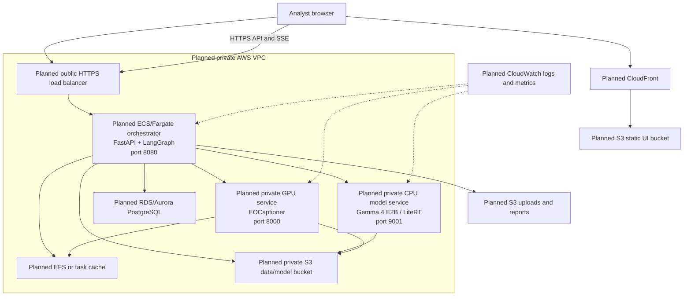
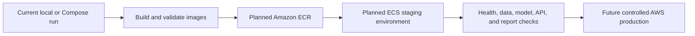

# Deployment

## Status

The repository currently supports local native processes and Docker Compose.
There is **no production AWS deployment** in the repository. This document
describes a proposed future AWS topology derived from the existing UI,
orchestrator, model services, ports, storage paths, and API contracts.

See [01-system-design.md](01-system-design.md) for the system architecture,
[02-technical-approach.md](02-technical-approach.md) for internal service
behavior, and [10-getting-started.md](10-getting-started.md) for local setup.

## 1. Current Components And Proposed AWS Homes

| Repository component | Current local form | Proposed AWS placement | Status |
| --- | --- | --- | --- |
| React/Vite UI | Vite development server or static `ui` container on port 80. | Amazon S3 static bucket behind Amazon CloudFront. | Planned |
| FastAPI orchestrator | Process/container on port 8080. | Amazon ECS service on Fargate behind an Application Load Balancer. | Planned |
| Gemma 4 E2B service | LiteRT server on port 9001 with a mounted model file. | Private ECS CPU service, with model artifacts staged from S3. | Planned; runtime compatibility must be validated. |
| EOCaptioner specialist | `server/serve.py` on port 8000; TerraFM plus language model bundle. | Private GPU-capable ECS/EC2 service behind internal service discovery. | Planned |
| BigEarthNet archives | ZIP files mounted locally. | Private Amazon S3 data bucket. | Planned |
| Patch cache | Docker named volume shared by orchestrator and specialist. | Amazon EFS shared mount or rebuildable task-local cache. | Planned; benchmark before selecting. |
| SQLite sessions and messages | Local SQLite file. | Amazon RDS/Aurora PostgreSQL for multi-instance operation. | Planned migration |
| Uploads and reports | Local directories under `data_store`. | Private S3 prefixes with protected download access. | Planned |
| Activity feed | In-process status bus and SSE endpoint. | SSE through the API load balancer; shared pub/sub only if replicas require it. | Current SSE; future shared events |

## 2. Proposed AWS Architecture

The proposed model services remain private. Only CloudFront and the API load
balancer are public entry points. The orchestrator calls model services over
private networking and security-group rules.

## 3. Planned Service Interfaces

| Service | Responsibility | Interface |
| --- | --- | --- |
| CloudFront + S3 | Deliver the compiled frontend. | HTTPS to browser; API configured as a separate origin. |
| Application Load Balancer | TLS termination and API routing. | Public HTTPS 443 to ECS target port 8080. |
| ECS orchestrator | Context validation, patch resolution, graph execution, tool calls, reports, and sessions. | Existing FastAPI routes on port 8080. |
| Main-model service | Respond to orchestrator model requests. | Existing LiteRT HTTP service on port 9001. |
| Specialist service | Run EOCaptioner generation. | Existing generation service on port 8000. |
| RDS/Aurora PostgreSQL | Future durable sessions, messages, context sets, and trace metadata. | Private database endpoint. |
| S3 | Archives, model bundles, uploads, reports, and versioned artifacts. | Private AWS SDK access. |
| EFS or local cache | Preserve the current shared extracted-band assumption where required. | Mounted filesystem. |
| CloudWatch | Central logs, health signals, and resource metrics. | AWS service integration. |

The current code assumes the orchestrator and EOCaptioner can use the same
absolute patch-cache path. A future deployment must preserve that contract with
EFS or change the tool boundary to pass object references. S3 is not itself a
drop-in replacement for a shared mounted directory.

## 4. Planned Configuration

Configuration is centralized in `orchestrator/app/config.py` and supplied by
environment variables. A future AWS deployment would map it as follows:

| Variable | Current meaning | Planned AWS value or handling |
| --- | --- | --- |
| `ORCHESTRATOR_PORT` | API listen port, default `8080`. | Container setting; load balancer target. |
| `LITERT_SERVER_URL` | URL of the main-model service. | Private service-discovery or internal load-balancer URL. |
| `EOCAPTIONER_URL` | URL of the ready specialist. | Private service-discovery or internal load-balancer URL. |
| `BIGEARTHNET_DATA_ROOT` | Local archive root. | Future S3-aware data adapter or staged private volume. |
| `ORCHESTRATOR_CACHE_DIR` | Extracted patch cache. | EFS mount or rebuildable task-local cache. |
| `ORCHESTRATOR_DB_PATH` | SQLite database path. | Retained for a single-task prototype only; replace with database settings for replicas. |
| `UPLOAD_STORE_DIR`, `REPORT_STORE_DIR` | Local storage directories. | Future S3 prefixes and protected URLs. |
| `CORS_ALLOW_ORIGINS` | Allowed browser origins. | CloudFront/application origin only. |
| `DEMO_PLACEHOLDERS` | Demo stand-ins for unavailable capabilities. | Set `false` for honest unsupported-task errors. |

Secrets should be stored in AWS Secrets Manager or SSM Parameter Store and
injected into tasks. They should not be committed to `.env` files, images, or
frontend build arguments.

## 5. Planned Network And Storage Controls

1. Keep S3 buckets private and use IAM task roles instead of embedded keys.
2. Place the orchestrator, model services, database, and shared filesystem in
	private subnets.
3. Expose only HTTPS through the load balancer; restrict model-service access
	to the orchestrator security group.
4. Version model bundles and archive data, and record those versions in release
	metadata where practical.
5. Treat patch caches as disposable and rebuildable from source data.
6. Tune load-balancer idle timeouts for SSE and long model requests after
	measuring the actual workload. The repository does not establish a universal
	timeout or capacity value.

## 6. Proposed Deployment Stages

| Stage | Purpose | Status |
| --- | --- | --- |
| Local | Run native processes, mocks, or Compose. | Implemented |
| Image validation | Build existing Dockerfiles and verify service health. | Available locally |
| AWS staging | Validate networking, S3 access, persistence, SSE, and model resources. | Planned |
| AWS production | Add backups, access control, monitoring, rollout, and capacity policy. | Future |

## 7. Current Deployment Limitations

- No AWS account resources, infrastructure-as-code, managed database migration,
  or production observability configuration is present.
- SQLite, local directories, and Compose volumes support the current local
  topology but should not be treated as multi-instance production durability.
- Only the single-image specialist is currently registry-ready; AWS hosting
  does not activate planned change, fusion, or segmentation tools.
- GPU type, scaling policy, throughput, and cost require deployment-specific
  measurements and are intentionally left open.

The AWS architecture in this document is therefore a proposed future design,
not a claim that production infrastructure already exists.
