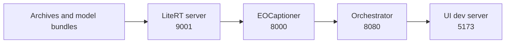

# Getting Started

This guide explains how to run SatQuery AI locally from a fresh checkout. It
covers the implemented UI, orchestrator, local main-model service, and ready
EOCaptioner specialist. It is not an AWS guide; proposed AWS deployment is
documented in [09-deployment.md](09-deployment.md).

For system behavior, see [01-system-design.md](01-system-design.md) and
[02-technical-approach.md](02-technical-approach.md). The
[orchestrator README](../orchestrator/README.md) remains the command-level
reference for the local pipeline.

## 1. Available Local Modes

| Mode | What it exercises | Requirements |
| --- | --- | --- |
| UI-only | React map, context manager, chat, sessions, uploads, and reports against MSW fixtures. | Node.js and npm. |
| Native full pipeline | Real API, local Gemma service, EOCaptioner, indexed raster data, and UI. | Python, Node.js, model bundles, BigEarthNet archives, and sufficient memory. |
| Docker Compose | The same service boundaries in containers. | Docker Compose, model bundles, archive files, and UI fixtures. |
| Remote specialist | Local UI/orchestrator with EOCaptioner on another machine. | Reachable specialist URL and compatible patch-cache/data arrangement. |

The current registry exposes the single-image EOCaptioner path as ready.
Bi-temporal, optical-SAR fusion, and segmentation contracts exist but are not
normal runnable specialist paths in the current orchestrator configuration.

## 2. Prerequisites

- Git and a fresh repository checkout.
- Python 3.13 for the verified native setup. Docker images use Python 3.11.
- Node.js and npm for the UI. The UI container uses Node 20 during its build.
- Docker Desktop or Docker Engine with Compose for container mode.
- Disk space for dependencies, model bundles, checkpoints, and raster archives.
- A compatible PyTorch environment for native EOCaptioner execution. The
  service can use CUDA when available and falls back to CPU.

## 3. Required Large Artifacts

Large data and model files are provisioned separately from source code:

| Artifact | Expected location or setting |
| --- | --- |
| BigEarthNet archives | Repository root by default: `BigEarthNet-Kosovo-S1.zip`, `BigEarthNet-Kosovo-S2.zip`, `BigEarthNet-Luxembourg-S1.zip`, and `BigEarthNet-Luxembourg-S2.zip`. |
| Gemma 4 E2B bundle | `orchestrator/gemma_models/gemma-4-E2B-it.litertlm`. |
| EOCaptioner bundle | `server/offline_model/`, including its local model assets. |
| Patch fixtures | `ui/src/mocks/fixtures/real-patches`, already tracked in the repository. |

Do not commit large datasets, weights, checkpoints, or secrets. BiTemporal
training/evaluation artifacts use the separate paths in `BiTemporal/configs/config.yaml`.

## 4. UI-Only Setup

From the repository root:

```powershell
Set-Location ui
npm install
npx msw init public/ --save
npm run dev
```

Open the URL printed by Vite. Without `VITE_API_BASE_URL`, development uses
Mock Service Worker fixtures. This mode needs no backend or model files.

Run the UI type-check with:

```powershell
npm run lint
```

## 5. Native Full Pipeline

### 5.1 Configure the root environment

Copy the template to the repository root. Both Compose and the local wrapper
script read the root `.env`:

```powershell
Copy-Item orchestrator\.env.example .env
```

For a real local model run, use local service URLs and disable demo stand-ins:

```text
LLM_BACKEND=litert
LITERT_SERVER_URL=http://localhost:9001
EOCAPTIONER_URL=http://localhost:8000
DEMO_PLACEHOLDERS=false
```

The template's Docker values use service names (`llm-litert` and
`eocaptioner`); native processes need `localhost`. Set data paths if the four
archives are not at the repository root. The script supplies absolute local
defaults for cache, SQLite, uploads, reports, and patch fixtures.

### 5.2 Start with the repository script

Use Git Bash or another Bash-compatible shell from the repository root:

```bash
./scripts/run_pipeline.sh
```

The script creates/reuses virtual environments, installs pinned dependencies,
starts services in order, writes logs under `logs/`, and cleans up on exit.



Useful options:

```bash
./scripts/run_pipeline.sh --no-ui
./scripts/run_pipeline.sh --no-eocaptioner
./scripts/run_pipeline.sh --gemini
```

The `--gemini` option requires the corresponding API key and is an optional
backend mode in the repository; the default local mode uses LiteRT. Use
`--no-eocaptioner` only when `EOCAPTIONER_URL` points to a reachable service.

Open `http://localhost:5173` and check `http://localhost:8080/health`, unless
ports were changed in `.env`.

### 5.3 Manual native startup

The wrapper is preferred, but services can be started separately. Use one
terminal per process.

**Orchestrator:**

```powershell
Set-Location orchestrator
py -3.13 -m venv .venv
\.venv\Scripts\Activate.ps1
python -m pip install -r requirements.txt
$env:PYTHONPATH = (Get-Location).Path
python -m uvicorn app.main:app --host 0.0.0.0 --port 8080
```

**LiteRT main-model service:**

```powershell
Set-Location orchestrator\litert_server
py -3.13 -m venv .venv
\.venv\Scripts\Activate.ps1
python -m pip install -r requirements.txt
$env:MODEL_PATH = "..\gemma_models\gemma-4-E2B-it.litertlm"
$env:LITERT_SERVER_PORT = "9001"
python server.py
```

**EOCaptioner specialist:**

```powershell
Set-Location server
py -3.13 -m venv .venv
\.venv\Scripts\Activate.ps1
python -m pip install -r requirements.txt
$env:EOCAPTIONER_PORT = "8000"
python serve.py --bundle offline_model --host 0.0.0.0
```

If a compatible global PyTorch installation already exists, the repository
README notes that a venv using system site packages can avoid a second large
PyTorch download. Verify package compatibility before relying on it.

**UI:**

```powershell
Set-Location ui
npm install
$env:VITE_API_BASE_URL = "http://localhost:8080"
npm run dev -- --port 5173
```

## 6. Docker Compose

From the repository root:

```powershell
Copy-Item orchestrator\.env.example .env
docker compose --profile litert --profile eocaptioner up --build
```

| Compose service | Port | Role |
| --- | ---: | --- |
| `ui` | Host 5173 to container 80 | Static production UI. |
| `orchestrator` | 8080 | FastAPI API and graph. |
| `llm-litert` | 9001 | Optional local Gemma service; mounts its bundle read-only. |
| `eocaptioner` | 8000 | Optional ready specialist; mounts offline bundle and shared patch cache. |

Inside Compose, keep `LITERT_SERVER_URL=http://llm-litert:9001` and
`EOCAPTIONER_URL=http://eocaptioner:8000`. Do not use `localhost` for those
container-to-container calls. To use a remote service, omit its profile and
set the corresponding URL to the remote address.

Stop the stack with:

```powershell
docker compose down
```

## 7. Verification

1. Check API health:

	```powershell
	Invoke-RestMethod http://localhost:8080/health
	```

	Confirm the status is `ok` and inspect the reported archive/fixture counts.
2. Open the UI and confirm the map and context manager load.
3. Select an indexed patch and inspect a preview.
4. Submit a single-image caption, VQA, or grounding query.
5. Watch activity for compatibility, resolution, agent, tool, validation, and
	composition stages.
6. Confirm the answer includes confidence, execution trace, and a report link.
	Grounding-shaped output may also produce a bbox evidence overlay.
7. With `DEMO_PLACEHOLDERS=false`, confirm unsupported pair/upload queries
	return structured errors rather than fabricated specialist results.

## 8. Troubleshooting

| Symptom | Likely cause | Remedy |
| --- | --- | --- |
| UI shows fixture responses | MSW is active or no API base URL is set. | Set `VITE_API_BASE_URL` and use the real API path; see `ui/README.md`. |
| Patch preview returns 422 | Missing or incorrectly mounted BigEarthNet archive. | Check `/health`, startup logs, archive names, and `BIGEARTHNET_DATA_ROOT`. |
| Orchestrator cannot reach Gemma | LiteRT service is down or URL/port mismatch. | Check port 9001, `LITERT_SERVER_URL`, and its health endpoint. |
| Specialist is unavailable | EOCaptioner is still loading, stopped, or URL is wrong. | Check `logs/eocaptioner.log`, port 8000, and `EOCAPTIONER_URL`. |
| Memory exhaustion | Gemma and EOCaptioner run together on a constrained machine. | Use `--gemini`, move EOCaptioner remotely with `--no-eocaptioner`, or use a larger machine. |
| Pair query is rejected | Change/fusion tools are not registry-ready. | This is expected current behavior; use an indexed single-image query. |
| Upload succeeds but query is rejected | Upload storage/preview exists, model ingestion does not. | Use an indexed patch for the ready query path. |
| Browser cannot call API | CORS origin mismatch. | Set `CORS_ALLOW_ORIGINS` to the exact UI origin and restart the API. |

## 9. Reset Local State

Press `Ctrl+C` to stop the wrapper. For Compose, run `docker compose down`.
Native runtime data lives under `orchestrator/data_store/`; Compose uses named
volumes for patch cache and orchestrator data. Delete those only when you
intentionally want to clear sessions, reports, uploads, and caches.
# Getting Started
