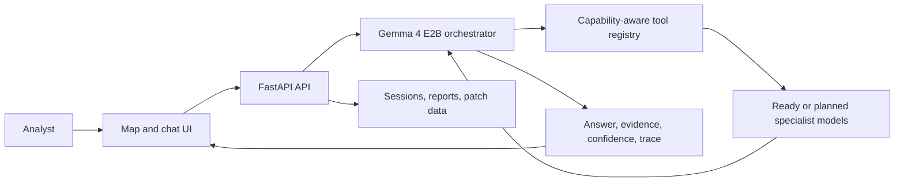

# SatQuery AI

**Agentic remote-sensing analysis for asking useful questions of satellite imagery.**

## What SatQuery AI Is

SatQuery AI combines a map-and-chat interface, structured imagery contexts, a
Gemma 4 E2B agentic orchestrator, and specialist Earth-observation models. A
user selects or prepares imagery, asks a natural-language question, and receives
an answer with available spatial evidence, confidence, execution trace, and a
downloadable report.

> **Project status:** The local application foundation and indexed single-image
> EOCaptioner path are implemented. Bi-temporal, optical-SAR fusion, and
> segmentation architectures are selected and documented, but their current
> orchestrator registry entries are not ready. AWS deployment is proposed only;
> no production AWS infrastructure currently exists.

## Why SatQuery AI?

Satellite analysis often requires switching between imagery viewers, raster
tools, model-specific prompts, and manual evidence inspection. SatQuery AI
provides one query-driven workflow that preserves the relationship between the
question, imagery context, specialist model, and returned evidence.

## Core Capabilities

| Capability | What it does | Current status |
| --- | --- | --- |
| Single-image VQA | Answers structured visual questions about an indexed optical/multispectral patch. | **Implemented** through the ready EOCaptioner tool. |
| Captioning | Describes scene content, land cover, and visible infrastructure. | **Implemented** through the single-image specialist contract. |
| Spatial grounding | Locates requested targets with normalized bounding-box evidence when the specialist returns coordinates. | **Implemented** for the ready path. |
| Bi-temporal change understanding | Supports the DeltaVLM / BiTemporal v2 design for change direction, transitions, ratios, severity, and comparisons. | **Model workstream implemented/evaluated separately; API tool integration is planned.** |
| Optical-SAR analysis | Uses the TerraFM fusion design for joint optical and SAR reasoning. | **Planned specialist integration.** |
| Segmentation | Covers the selected SAM prompt-mask and TerraFM-UperNet thematic LULC designs. | **Planned; endpoint contract exists but model is not integrated in normal operation.** |
| Agentic orchestration | Validates context, selects ready tools, executes them, validates observations, retries bounded malformed outputs, and composes traceable responses. | **Implemented.** |

## High-Level Architecture



The orchestrator is implemented as a LangGraph `StateGraph`. It resolves
indexed patch references, keeps filesystem details out of model prompts, calls
only registry-ready tools, and returns the frontend response contract. See
[01-system-design.md](docs/01-system-design.md) and
[02-technical-approach.md](docs/02-technical-approach.md).

## Inputs And Outputs

### Supported input shapes

- Indexed BigEarthNet-style optical/multispectral patches with optional SAR
	bands for the current ready path.
- Typed `single`, `bitemporal_pair`, and `cross_modal_pair` context contracts
	in the UI and API.
- User uploads in GeoTIFF/TIFF/PNG/JPEG format can be stored and previewed;
	querying uploaded imagery is not enabled in the current specialist path.
- Natural-language questions, including VQA, captioning, grounding, change,
	fusion, and segmentation intents where the corresponding specialist is ready.

### Response artifacts

Successful query responses can contain a natural-language answer, confidence,
structured spatial evidence, an execution trace, and a report URL. Unsupported
or incompatible contexts return structured API errors rather than being routed
through an unrelated specialist.

## Key Models And Components

| Component | Role | Decision or implementation reference |
| --- | --- | --- |
| Gemma 4 E2B | Main agentic orchestrator model. | [ADR 0001](docs/adr/0001-orchestrator-choice.md) |
| EOCaptioner with TerraFM visual encoder and projected language model | Current ready single-image VQA, captioning, and grounding service. | `server/serve.py`, [ADR 0002](docs/adr/0002-single-image-model-choice.md) |
| TinyRS-R1 | Selected optical VLM and language-decoder family for single-image and temporal reasoning. | [ADR 0002](docs/adr/0002-single-image-model-choice.md) |
| DeltaVLM / BiTemporal v2 | Selected bi-temporal change-understanding model. | [ADR 0004](docs/adr/0004-change-detection-architecture.md) |
| TerraFM dual-branch fusion | Selected optical-SAR fusion architecture. | [ADR 0003](docs/adr/0003-fusion-encoder-choice.md) |
| SAM and TerraFM-UperNet | Selected prompt-based and thematic segmentation architectures. | [ADR 0005](docs/adr/0005-segmentation-model-choice.md) |
| LangGraph, FastAPI, patch index, SQLite, report store | Runtime orchestration, API, data resolution, session persistence, and reporting. | [02-technical-approach.md](docs/02-technical-approach.md) |

## Datasets And Evaluation

- **BigEarthNet S1/S2 archives:** runtime indexed optical and SAR patch data.
- **CDVQA / SECOND-derived data:** BiTemporal training and validation data with
	eight change-question categories.
- **VRSBench and RSVQA:** selected single-image VQA, captioning, and grounding
	evaluation references.
- **CORINE Land Cover:** selected thematic segmentation taxonomy.

The repository records a **58.25% exact-match result on a balanced 400-sample
BiTemporal evaluation**; detailed per-question-type results and evaluation
boundaries are in [03-models-and-metrics.md](docs/03-models-and-metrics.md).
Dataset roles and split information are documented in
[05-datasets.md](docs/05-datasets.md), with sources consolidated in
[06-references.md](docs/06-references.md).

## Tech Stack

| Layer | Technologies |
| --- | --- |
| Frontend | React, TypeScript, Vite, Zustand, MapLibre GL JS, Turf.js, Tailwind CSS, MSW fixtures. |
| API and orchestration | Python, FastAPI, LangGraph, LangChain Core, SSE activity feed. |
| Model serving | LiteRT-LM service for Gemma 4 E2B; PyTorch, Transformers, TerraFM, and local EOCaptioner bundle. |
| Data and persistence | Rasterio, GeoTIFF/TIFF, BigEarthNet archives, SQLite sessions, filesystem reports/cache. |
| Packaging | Dockerfiles and Docker Compose; native local and HPC/Slurm scripts are also provided. |

## Quick Start

### UI-only mode

```bash
cd ui
npm install
npx msw init public/ --save
npm run dev
```

This runs the frontend against Mock Service Worker fixtures and requires no
model files. For the real local stack, follow
[10-getting-started.md](docs/10-getting-started.md).

### Docker Compose mode

From the repository root, provide the required model/data artifacts, then:

```bash
cp orchestrator/.env.example .env
docker compose --profile litert --profile eocaptioner up --build
```

Open `http://localhost:5173`; the orchestrator health endpoint is
`http://localhost:8080/health` by default. On Windows PowerShell, use
`Copy-Item orchestrator\.env.example .env` for the copy step. The full native
startup order, environment variables, manual commands, and troubleshooting are
in [10-getting-started.md](docs/10-getting-started.md).

## Future AWS Deployment

AWS deployment is **proposed, not implemented**. The intended future topology
keeps the current service boundaries: CloudFront/S3 for the static UI, ECS for
the orchestrator, private CPU/GPU model services, S3 for archives/model
artifacts/uploads/reports, and RDS/Aurora PostgreSQL when multi-instance
persistence is required. See [09-deployment.md](docs/09-deployment.md) for the
planned diagram, interfaces, configuration mapping, and deployment stages.

## Documentation Index

| Document | Focus |
| --- | --- |
| [01. System Design](docs/01-system-design.md) | System boundary and high-level architecture. |
| [02. Technical Approach](docs/02-technical-approach.md) | Internal request, data, model-serving, validation, and integration paths. |
| [03. Models and Metrics](docs/03-models-and-metrics.md) | Model roles, evaluation evidence, and metric mapping. |
| [04. User Flow](docs/04-user-flow.md) | Analyst-facing context, query, progress, evidence, and report workflow. |
| [05. Datasets](docs/05-datasets.md) | Runtime data, training data, benchmarks, and split boundaries. |
| [06. References](docs/06-references.md) | Papers, datasets, frameworks, standards, and source links. |
| [07. Feasibility and Viability](docs/07-feasibility-viability.md) | Repository-backed technical and operational feasibility. |
| [08. Impact](docs/08-impact.md) | Practical impact across users and remote-sensing use cases. |
| [09. Deployment](docs/09-deployment.md) | Current local topology and proposed future AWS deployment. |
| [10. Getting Started](docs/10-getting-started.md) | Local prerequisites, setup, startup, verification, and troubleshooting. |

## Architecture Decision Records

The ADRs are the source of truth for chosen architectural and model decisions:

- [ADR 0001: Orchestrator Choice](docs/adr/0001-orchestrator-choice.md)
- [ADR 0002: Single-Image Model Choice](docs/adr/0002-single-image-model-choice.md)
- [ADR 0003: Optical-SAR Fusion Encoder Choice](docs/adr/0003-fusion-encoder-choice.md)
- [ADR 0004: Bi-Temporal Change Detection Architecture](docs/adr/0004-change-detection-architecture.md)
- [ADR 0005: Segmentation Model Choice](docs/adr/0005-segmentation-model-choice.md)

## References

The organized source list is maintained in
[06-references.md](docs/06-references.md), including TinyRS-R1, TerraFM,
DeltaVLM, TCSSM, DARFT, SAM, UperNet, BigEarthNet, CDVQA, VRSBench, RSVQA,
CORINE Land Cover, and the project frameworks.
