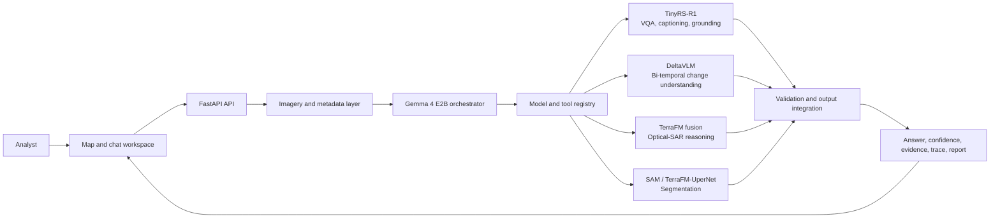

<div align="center">

# SatQuery AI

### Agentic multimodal intelligence for satellite imagery

<p>
  A map-and-chat workflow for querying, understanding, grounding, and comparing
  remote-sensing imagery through specialist models and structured evidence.
</p>

[](01-system-design.md)
[](02-technical-approach.md)
[](04-user-flow.md)
[](09-deployment.md)

</div>

> **Project brief**
> SatQuery AI connects imagery selection, natural-language analysis, specialist
> execution, observation validation, spatial evidence, and auditable reporting
> in one integrated remote-sensing workflow.

## At A Glance

| Dimension | SatQuery AI |
| --- | --- |
| Analysis surface | Map, imagery context, chat, evidence overlays, and reports |
| Reasoning layer | Gemma 4 E2B with LangGraph orchestration |
| Specialist coverage | VQA, captioning, grounding, change understanding, optical-SAR fusion, and segmentation |
| Primary data | BigEarthNet Sentinel-1/Sentinel-2 archives and CDVQA temporal QA data |
| Evidence | Bounding boxes, masks, change regions, confidence, and execution traces |
| Deployment shape | Local services and an AWS-oriented service architecture |

<div align="center">

**Explore the architecture, then jump directly to the workflow or setup guide.**

[System Design](01-system-design.md) · [User Flow](04-user-flow.md) · [Getting Started](10-getting-started.md)

</div>

## System Overview

The platform combines the user input layer, geospatial data retrieval, Gemma 4
E2B orchestration, specialist model execution, validation, and output
integration into one end-to-end analysis system.



## Capability Matrix

| Capability | Integrated function | Main components |
| --- | --- | --- |
| Single-image VQA | Answer questions about land cover, infrastructure, environment, and scene content. | TinyRS-R1 and EOCaptioner |
| Scene captioning | Describe satellite scenes, land cover, visible infrastructure, location, and seasonal context. | TinyRS-R1 and EOCaptioner |
| Spatial grounding | Locate requested objects and regions using normalized coordinate evidence and visual overlays. | TinyRS-R1 and EOCaptioner |
| Bi-temporal change understanding | Explain change, direction, transition, ratio, severity, and largest/smallest change between $t_1$ and $t_2$. | DeltaVLM / BiTemporal v2 |
| Optical-SAR analysis | Combine complementary optical and SAR observations for multisensor reasoning. | TerraFM dual-branch fusion |
| Segmentation | Produce prompt-based feature masks and thematic land-cover segmentation. | SAM and TerraFM + UperNet |
| Agentic orchestration | Interpret intent, validate context, select specialists, execute tools, validate observations, retry malformed outputs, and compose results. | Gemma 4 E2B and LangGraph |

## Inputs And Outputs

### Inputs

- Indexed optical and multispectral satellite patches.
- Sentinel-1 SAR observations with `VV` and `VH` bands.
- Bi-temporal pairs representing the same location at different times.
- Co-registered optical-SAR pairs.
- GeoTIFF/TIFF, PNG, and JPEG imagery through the upload workflow.
- Natural-language questions and structured spatial prompts.

Contexts are represented as `single`, `bitemporal_pair`, or
`cross_modal_pair` sets. Patch references preserve location, timestamp,
modality, and band-selection metadata.

### Outputs

- Natural-language answer.
- Confidence score.
- Spatial evidence including bounding boxes, masks, and change regions.
- Execution trace containing task, models, tools, and parameters.
- Persisted downloadable report.
- Structured validation responses for invalid or incompatible inputs.

## Component Map

| Component | Function | Reference |
| --- | --- | --- |
| Gemma 4 E2B | Main agentic reasoning and model/tool orchestration. | [ADR 0001](adr/0001-orchestrator-choice.md) |
| LangGraph StateGraph | Controls validation, resolution, specialist calls, retry, and response composition. | [01-system-design.md](01-system-design.md) |
| TinyRS-R1 | Remote-sensing VLM for single-image VQA, captioning, grounding, and language decoding. | [ADR 0002](adr/0002-single-image-model-choice.md) |
| TerraFM | Earth-observation representation for optical, SAR, fusion, and temporal processing. | [ADR 0003](adr/0003-fusion-encoder-choice.md) |
| DeltaVLM / BiTemporal v2 | Question-conditioned temporal difference understanding. | [ADR 0004](adr/0004-change-detection-architecture.md) |
| SAM and UperNet | Prompt-based and thematic land-cover segmentation. | [ADR 0005](adr/0005-segmentation-model-choice.md) |
| EOCaptioner service | Specialist inference combining TerraFM visual features and language generation. | [02-technical-approach.md](02-technical-approach.md) |
| Patch index and raster layer | Resolves patch IDs, extracts bands, renders previews, and manages cached inputs. | [05-datasets.md](05-datasets.md) |
| Session and report stores | Persist context, messages, evidence, traces, and reports. | [04-user-flow.md](04-user-flow.md) |

## Datasets And Evaluation

- **BigEarthNet S1/S2 archives:** indexed optical and SAR runtime imagery.
- **CDVQA / SECOND-derived data:** bi-temporal training and validation data
  with eight change-question categories.
- **VRSBench and RSVQA:** single-image VQA, captioning, and grounding
  evaluation benchmarks.
- **CORINE Land Cover:** thematic segmentation taxonomy.

The BiTemporal evaluation reports 58.25% exact-match accuracy on a balanced
400-sample evaluation set. Detailed model roles, per-task evaluation, datasets,
preprocessing, and benchmarks are documented in
[03-models-and-metrics.md](03-models-and-metrics.md) and
[05-datasets.md](05-datasets.md).

## Technology Stack

| Layer | Technologies |
| --- | --- |
| Frontend | React, TypeScript, Vite, Zustand, MapLibre GL JS, Turf.js, Tailwind CSS, and MSW. |
| API and orchestration | Python, FastAPI, LangGraph, LangChain Core, and Server-Sent Events. |
| Model serving | LiteRT-LM, PyTorch, Transformers, TerraFM, TinyRS-R1, LoRA, and local model bundles. |
| Data processing | Rasterio, GeoTIFF/TIFF, NumPy, Pillow, and BigEarthNet archives. |
| Persistence | SQLite sessions, filesystem cache, uploads, and JSON reports. |
| Packaging | Docker, Docker Compose, native local scripts, and HPC/Slurm support. |

## Integrated System

The complete SatQuery AI architecture is implemented as an integrated
workflow across the frontend, API, data layer, agentic orchestrator, model and
tool registry, specialist pipelines, observation validation, evidence
generation, trace creation, persistence, and reporting.

## Quick Start

### UI development

```bash
cd ui
npm install
npx msw init public/ --save
npm run dev
```

### Full local stack

From the repository root:

```bash
cp orchestrator/.env.example .env
docker compose --profile litert --profile eocaptioner up --build
```

Open `http://localhost:5173`; the orchestrator health endpoint is
`http://localhost:8080/health` by default. On Windows PowerShell, use
`Copy-Item orchestrator\.env.example .env` for the environment template.

The complete local setup, environment variables, service order, verification,
and troubleshooting are in [10-getting-started.md](10-getting-started.md).

## AWS Deployment Architecture

The deployment plan maps the integrated service boundaries to AWS using
CloudFront and S3 for the frontend, ECS for the orchestrator, private CPU/GPU
model services, S3 data and model storage, managed relational persistence, and
private networking. The complete deployment design is in
[09-deployment.md](09-deployment.md).

## Documentation Index

| Document | Focus |
| --- | --- |
| [01. System Design](01-system-design.md) | End-to-end architecture and system boundaries. |
| [02. Technical Approach](02-technical-approach.md) | Internal request, data, orchestration, specialist, and output flow. |
| [03. Models and Metrics](03-models-and-metrics.md) | Model roles, benchmarks, evaluation evidence, and metrics. |
| [04. User Flow](04-user-flow.md) | User-facing imagery, query, progress, evidence, and report workflow. |
| [05. Datasets](05-datasets.md) | Runtime datasets, training data, benchmarks, and preprocessing. |
| [06. References](06-references.md) | Papers, datasets, frameworks, standards, and authoritative sources. |
| [07. Feasibility and Viability](07-feasibility-viability.md) | Technical, computational, and operational feasibility. |
| [08. Impact](08-impact.md) | User groups, remote-sensing use cases, and practical impact. |
| [09. Deployment](09-deployment.md) | Service deployment architecture and AWS mapping. |
| [10. Getting Started](10-getting-started.md) | Local prerequisites, installation, startup, and troubleshooting. |

## Architecture Decision Records

- [ADR 0001: Orchestrator Architecture](adr/0001-orchestrator-choice.md)
- [ADR 0002: Single-Image Optical Remote-Sensing VLM](adr/0002-single-image-model-choice.md)
- [ADR 0003: Optical-SAR Cross-Modal Fusion Encoder](adr/0003-fusion-encoder-choice.md)
- [ADR 0004: Bi-Temporal Change Understanding and CDVQA](adr/0004-change-detection-architecture.md)
- [ADR 0005: Segmentation Architecture](adr/0005-segmentation-model-choice.md)

The ADRs are the authoritative record of the selected architectural and model
decisions.

## References

See [06-references.md](06-references.md) for the consolidated source index
covering TinyRS-R1, Qwen2-VL, TerraFM, DeltaVLM, TCSSM, DARFT, SAM, UperNet,
BigEarthNet, CDVQA, VRSBench, RSVQA, CORINE Land Cover, and project frameworks.
