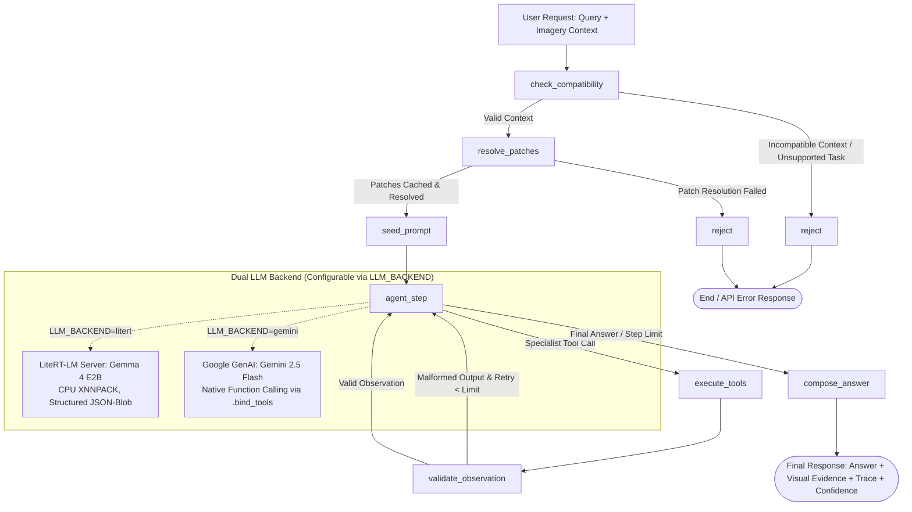

# ADR 0001: Orchestrator Architecture — Gemma 4 E2B with LangGraph StateGraph

## Context & Role
SatQuery AI is an agentic remote-sensing VLM system that enables users to query, analyze, and ground satellite images using natural language. Remote sensing tasks require handling diverse modalities (Optical/Multispectral Sentinel-2, SAR Sentinel-1), multi-image configurations (bi-temporal pairs, cross-modal pairs), and specialist tasks (VQA, captioning, spatial grounding, temporal change detection, and LULC semantic segmentation).

Instead of applying a single generic Large Vision-Language Model, the system employs an **Agentic Orchestrator** that acts as the intelligent brain:
1. Interprets natural language queries and classifies the requested task intent.
2. Checks the number, modality, format, and spatial metadata of input images (validating GeoTIFF/TIFF bounds, CRS, and co-registration).
3. Selects, sequences, and executes appropriate specialist models from the tool registry.
4. Enforces strict query prompt templates required by specialist models.
5. Employs observation validation and corrective retry logic for malformed outputs.
6. Returns an evidence-grounded answer, confidence score, visual evidence, and an auditable execution trace.

---

## Chosen Architecture

### 1. LangGraph StateGraph Engine
The orchestrator is built on **LangGraph** (`orchestrator/app/graph.py`), replacing legacy fixed-loop agents with a deterministic 5-stage state machine:

### 2. Dual LLM Backend Support
The orchestrator supports two swappable model backends via the `LLM_BACKEND` environment variable, requiring zero code changes to toggle:

* **Primary Local Backend: Gemma 4 E2B (LiteRT-LM)**
  - Runs on-device via Google's **LiteRT-LM** (`orchestrator/litert_server/`) using pre-built XNNPACK CPU cache files.
  - Highly efficient (<2.5 GB RAM resident footprint), requiring no dedicated GPU.
  - Decoupled into an independent microservice so native C++ inference runtimes do not pollute the core orchestrator.
  - Generates structured JSON action blobs (`{"action": tool_name, "action_input": {...}}`) with defensive regex parsing and corrective re-prompting.

* **Cloud Acceleration Backend: Google Gemini 2.5 Flash**
  - Integrated via `langchain-google-genai` for low-latency cloud inference.
  - Uses native tool calling via `llm.bind_tools()`, returning typed tool calls with zero parsing overhead.

---

## Orchestrator Execution Pipeline

1. **`check_compatibility`:** Inspects `contextSet.type` (`single_patch`, `bitemporal_pair`, `cross_modal_pair`), input coordinate bounds, and ground truth hints against `registry.py`. If a query requests an unintegrated capability, it returns an explicit `unsupported_task` or `incompatible_context` error immediately without wasting LLM inference cycles.
2. **`resolve_patches`:** Communicates with the data pipeline (`orchestrator/data/`) to resolve patch IDs to local filesystem rasters, extracting multi-band Sentinel-1 and Sentinel-2 data from ZIP archives into cache.
3. **`seed_prompt`:** Formulates the operational context, injecting spatial boundaries, metadata, available tool documentation, and few-shot formatting examples.
4. **`agent_step`:** Evaluates the current state, generating either a tool call to a specialist model or synthesizing the final answer.
5. **`execute_tools`:** Invokes only ready specialist models registered in `registry.py`. File paths are passed directly via the execution graph, keeping filesystem details out of the LLM prompt.
6. **`validate_observation`:** Inspects specialist output structure (e.g., verifying MCQ letters, bounding box coordinates). If the output is malformed, it loops back with a corrective nudge.
7. **`compose_answer`:** Bundles the natural-language answer, confidence metrics, spatial bounding boxes/masks, and the full step-by-step execution trace for frontend consumption.

---

## Tool Registry & Safety Policy (`orchestrator/tools/registry.py`)
To ensure the orchestrator never hallucinates nonexistent tools:
- Specialist models must define a `capabilities.json` schema with `"status": "ready"`.
- Only `"ready"` tools are bound to the LLM agent or dispatchable by the execution graph.
- Specialist tool schemas are defined in `future_tools.py` with typed contracts, while the registry connects each integrated implementation to the orchestration graph.

---

## Technical Specifications & Configuration
* **Language & Framework:** Python 3.13, FastAPI, LangGraph 0.3+, LangChain Core.
* **Default Port:** `8080` (orchestrator API), `9001` (litert_server).
* **State Persistence:** SQLite database (`data_store/orchestrator.db`) for multi-turn session and message storage.
* **Trace Output:** Generates structured JSON execution logs detailing selected task, models used, input parameters, and observations.

---

## References
* Google LiteRT-LM Documentation: `https://ai.google.dev/edge/litert`
* LangGraph Framework: `https://langchain-ai.github.io/langgraph/`
