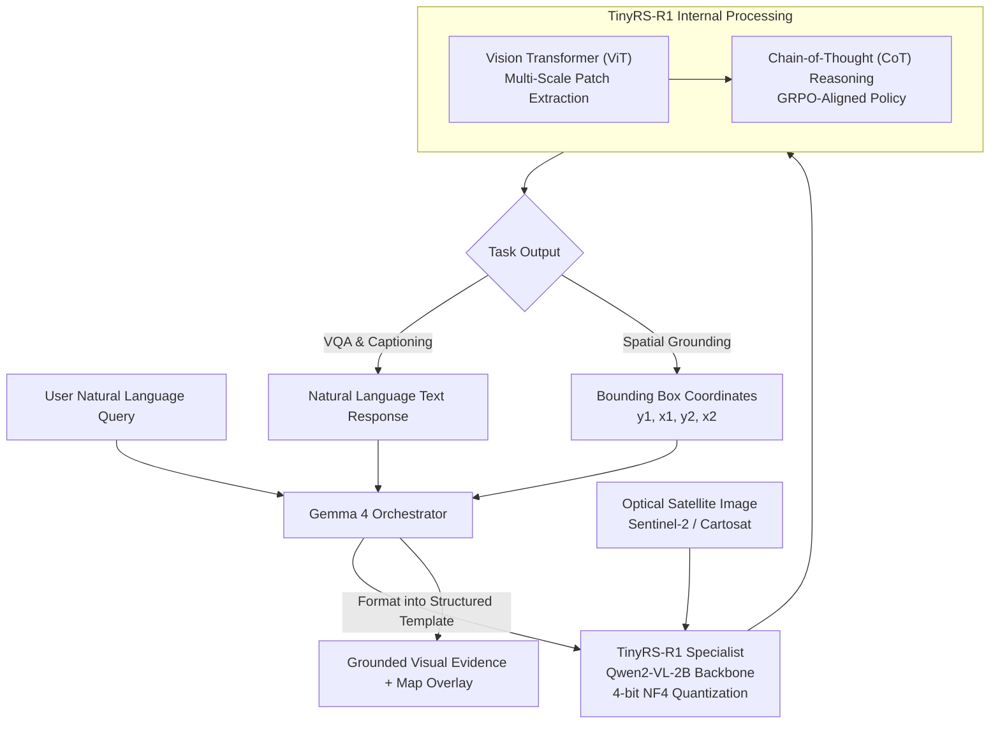

# ADR 0002: Single-Image Optical Remote Sensing VLM — TinyRS-R1

## Context & Role
Single-image optical understanding is the foundational capability of the SatQuery AI system. The specialist model is tasked with processing optical and multispectral remote-sensing imagery (e.g., Sentinel-2, Cartosat) to execute three essential tasks:
1. **Visual Question Answering (VQA):** Answering natural-language questions regarding land use, structural objects, environmental attributes, and season/climate.
2. **Scene Captioning:** Generating comprehensive descriptions of land cover and visible infrastructure.
3. **Spatial Grounding:** Delineating precise bounding box coordinates for user-specified target categories or point anchors.

General-purpose vision-language models fail on satellite scenes due to top-down nadir viewpoints, multi-scale targets, non-RGB multispectral bands, and specialized domain vocabulary. SatQuery AI adopts **TinyRS-R1** as its dedicated single-image optical specialist.

---

## Chosen Model: TinyRS-R1



### Architecture & Design
TinyRS-R1 is a specialized 2-billion parameter remote-sensing vision-language model built upon the **Qwen2-VL-2B** architecture and optimized specifically for Earth observation:

1. **Backbone Architecture:** Qwen2-VL-2B visual language model combining a high-resolution Vision Transformer (ViT) with an autoregressive language decoder.
2. **Reasoning Engine (Chain-of-Thought):** Trained with Chain-of-Thought (CoT) reasoning paths, enabling the model to generate explicit internal rationales before producing final remote-sensing classifications or coordinates.
3. **Alignment via GRPO:** Fine-tuned using Group Relative Policy Optimization (GRPO), aligning outputs with domain truth and reducing hallucination on complex satellite scenes.
4. **Quantization & Efficiency:** Runs efficiently in **4-bit NF4 quantization** with Float16 compute, requiring only **~2–3 GB VRAM**. This compact footprint allows it to run smoothly on workstation GPUs (such as RTX 3060/4060) alongside the orchestrator.
5. **Spatial Grounding:** Natively outputs normalized bounding box coordinates for targets specified by spatial references (`<ref>category</ref>`) or point anchors (`<point>(x, y)</point>`).

---

## Supported Query Shapes & Templates
To ensure deterministic execution and avoid off-template degradation, queries sent to TinyRS-R1 are templated by the orchestrator into four primary shapes:

1. **Scene Captioning:**
   ```text
   "Describe this satellite image, including the location, season, and observed land cover."
   ```
2. **Binary Verification (Yes/No):**
   ```text
   "Is there any water body visible in this image?"
   "Does the image capture urban fabric?"
   ```
3. **Multiple Choice Question (MCQ):**
   ```text
   "Which of the following best describes the dominant land cover: a) forest b) urban c) agriculture d) water?"
   ```
4. **Spatial Bounding Box Grounding:**
   ```text
   "Locate a patch of <ref>arable land</ref> present in the image."
   "Create a bounding box around the land cover class instance located at <point>(0.5, 0.5)</point> in the satellite image."
   ```

---

## Evaluation Benchmarks
The performance of TinyRS-R1 is evaluated across standard remote-sensing vision-language benchmarks:
* **VRSBench (arXiv:2406.12384):** Evaluates visual question answering, detailed caption generation, and object grounding across diverse satellite scenes.
* **RSVQA (rsvqa.sylvainlobry.com):** Measures presence/absence, counting, and comparison accuracy on Sentinel-2 and high-resolution optical imagery.

---

## Technical Specifications Summary
* **Parameter Count:** ~2.2 Billion parameters.
* **Inference Footprint:** ~2–3 GB VRAM in 4-bit NF4.
* **Input Formats:** Optical/Multispectral GeoTIFF/TIFF, PNG, JPEG.
* **Coordinate Space:** Normalized bounding box format `[ymin, xmin, ymax, xmax]`.
* **Serving Runtime:** PyTorch / vLLM / HuggingFace Transformers.

---

## References
* **TinyRS-R1:** Aybora et al., *"TinyRS: Thinking Small in Remote Sensing Foundation Models,"* arXiv:2505.12099, 2025.
* **VRSBench:** Wang et al., *"VRSBench: A Versatile Vision-Language Benchmark for Remote Sensing,"* arXiv:2406.12384, 2024.
* **RSVQA:** Lobry et al., *"RSVQA: Visual Question Answering for Remote Sensing Data,"* IEEE TGRS, 2020.
