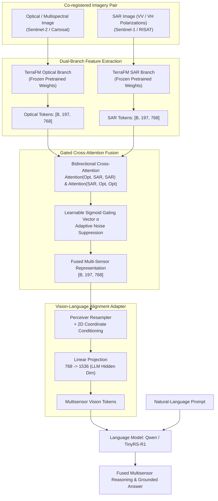

# ADR 0003: Optical–SAR Cross-Modal Fusion Encoder — Dual-Branch TerraFM

## Context & Role
Satellite analysis relying solely on optical imagery frequently fails due to cloud occlusion, atmospheric haze, and night-time conditions. Synthetic Aperture Radar (SAR, e.g., Sentinel-1, RISAT) operates in microwave wavelengths (C-band, X-band), providing all-weather, day-and-night imaging capable of penetrating cloud cover and sensing surface geometry, roughness, and dielectric moisture. However, SAR lacks multispectral reflective signatures and exhibits multiplicative speckle noise and geometric distortions.

To answer joint optical–SAR queries (e.g., *"Use the optical and SAR images together to identify built-up and water-covered regions"*), SatQuery AI requires a multimodal fusion architecture that extracts complementary features from co-registered optical and SAR image pairs.

---

## Chosen Model: Dual-Branch TerraFM with Gated Cross-Attention

SatQuery AI uses **TerraFM** (arXiv:2506.06281) configured with a **Dual-Branch Gated Cross-Attention** architecture and a **Perceiver Resampler** adapter connected to a Qwen language backbone.

---

## Architecture & Technical Details

### 1. Dual-Branch Visual Backbone
* **Visual Encoder:** TerraFM Vision Transformer (ViT) with patch size $14 \times 14$.
* **Input Resolution:** $224 \times 224$ pixels.
* **Token Output:** 197 vision tokens per modality (including class token) with embedding dimension $D = 768$.
* **Preservation Strategy:** Both optical and SAR branches utilize frozen TerraFM foundational weights to preserve self-supervised Earth observation representations while avoiding catastrophic forgetting during adapter training.

### 2. Gated Cross-Attention Mechanism
Directly concatenating SAR and optical bands risks corrupting optical spectral details with radar speckle noise. TerraFM's gated cross-attention calculates directional cross-modal interactions:
$$F_{\text{cross}} = \text{MultiHeadAttention}(Q = F_{\text{opt}}, K = F_{\text{sar}}, V = F_{\text{sar}})$$
A learnable sigmoid gating vector $\alpha \in [0, 1]^D$ adaptively modulates the integration:
$$F_{\text{fused}} = F_{\text{opt}} + \alpha \odot F_{\text{cross}}$$
* In clear conditions, $\alpha$ automatically down-weights SAR features, preserving pure optical spectral fidelity.
* In cloudy, hazy, or shaded conditions, $\alpha$ dynamically activates SAR backscatter signals, recovering structural and moisture details invisible to the optical sensor.

### 3. Vision-Language Alignment Adapter
To align fused 768-dimensional vision tokens with the language model:
* **Perceiver Resampler:** Compresses the token sequence into fixed-length latent queries.
* **2D Coordinate Conditioning:** Injects sinusoidal positional embeddings to maintain continuous geographic coordinate alignment.
* **Linear Projector:** Projects embeddings from $768 \rightarrow 1536$ dimensions to match the hidden state of the Qwen / TinyRS-R1 language decoder.

---

## Training Strategy & Datasets
* **Primary Dataset:** **BigEarthNet.txt** (arXiv:2603.29630) — contains paired Sentinel-1 SAR and Sentinel-2 multispectral tiles across Europe with land-cover labels and multimodal query-answer pairs.
* **Training Protocol:**
  - *Phase 1:* Freeze TerraFM encoder branches; train the gated cross-attention module and Perceiver Resampler on multimodal VQA and grounding objectives.
  - *Phase 2:* Fine-tune low-rank LoRA adapters on the language model to align multi-sensor tokens with natural-language reasoning.
* **Alternative Benchmark Evaluated:** **CROMA** (Cross-Modal Remote Sensing pretraining) was evaluated as a comparative downloadable baseline for optical–SAR representation quality.

---

## Technical Specifications Summary
* **Input Channels:** Sentinel-2 (B02, B03, B04, B08) + Sentinel-1 (VV, VH).
* **Fusion Dimension:** 768 dimensions per token.
* **Projected Language Dimension:** 1536 dimensions.
* **Target Modalities:** Co-registered Optical/SAR GeoTIFF, TIFF, PNG/JPEG.

---

## References
* **TerraFM:** MBZUAI, *"TerraFM: An Earth Observation Foundation Model for Multisensor Remote Sensing,"* arXiv:2506.06281, 2025.
* **BigEarthNet.txt:** *"BigEarthNet.txt: A Large-Scale Multimodal Dataset for Earth Observation,"* arXiv:2603.29630, 2026.
* **Gated-Guided Fusion:** *"Gated-Guided Fusion for Optical-SAR Object Detection,"* 2026.
* **CROMA:** Anthony et al., *"CROMA: Cross-Modal Remote Sensing Foundation Model,"* 2023.
