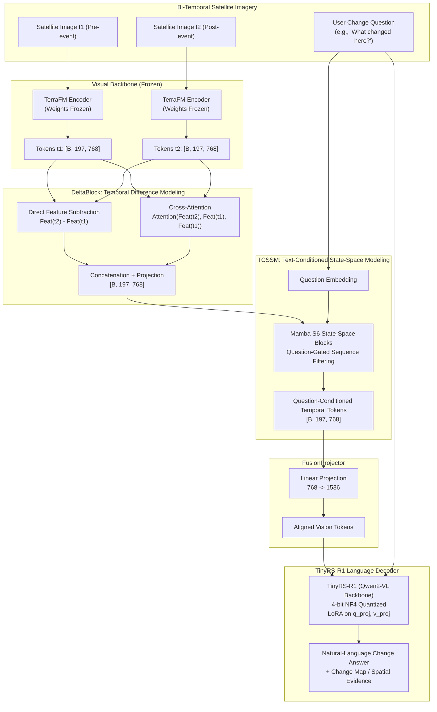

# ADR 0004: Bi-Temporal Change Understanding & CDVQA — DeltaVLM with TCSSM & DARFT

## Context & Role
Detecting and explaining environmental, infrastructural, and agricultural changes between satellite captures at different dates ($t_1 \rightarrow t_2$) is a core capability of SatQuery AI. Users interact with multitemporal satellite scenes through natural-language queries:
- *"What changed between these two dates, and where did the change occur?"*
- *"Has the built-up area increased, decreased, or remained unchanged?"*
- *"Which region or object experienced the largest change?"*

Conventional change detection networks only generate binary difference masks without semantic explanations. Conversely, standard Vision-Language Models struggle to detect localized change deltas when given two full scenes due to attention dilution over invariant backgrounds. SatQuery AI implements **BiTemporal v2 / DeltaVLM**, an architecture built specifically for change visual question answering and spatial change localization.

---

## Chosen Model: DeltaVLM / BiTemporal v2 with TCSSM & DARFT

The architecture combines a frozen **TerraFM** vision encoder, a **DeltaBlock** for temporal difference modeling, a **TCSSM** (Text-Conditioned State-Space Modeling) module, a **FusionProjector**, and a **TinyRS-R1** language model with LoRA fine-tuning, hardened using the **DARFT** technique.

---

## Architectural Components (`BiTemporal/`)

### 1. TerraFM Visual Backbone
* Extracts spatial feature tokens independently from each satellite image ($t_1$ and $t_2$).
* Emits $197\text{ tokens} \times 768\text{ dimensions}$ per image.
* Maintained **frozen** during training to preserve generalized remote-sensing representations.

### 2. DeltaBlock (Temporal Difference Modeling)
The DeltaBlock captures both absolute magnitude changes and relational dynamics across time steps:
$$\Delta_{\text{sub}} = F(t_2) - F(t_1)$$
$$\Delta_{\text{attn}} = \text{MultiHeadAttention}(Q = F(t_2), K = F(t_1), V = F(t_1))$$
$$F_{\text{delta}} = \text{Linear}(\text{Concat}[\Delta_{\text{sub}}, \Delta_{\text{attn}}])$$
This explicit differencing eliminates background noise from invariant land cover, ensuring only genuine changes propagate downstream.

### 3. TCSSM (Text-Conditioned State-Space Modeling, arXiv:2508.08974)
Temporal questions are selective: asking *"Did water decrease?"* requires inspecting different spatial transitions than *"Did construction expand?"*
* TCSSM uses **Mamba S6 state-space blocks** conditioned on the user's question embedding.
* A question-guided gating mechanism dynamically regulates how temporal information accumulates across the vision-token sequence, focusing processing on the specific phenomenon queried.

### 4. FusionProjector & TinyRS-R1 LoRA
* **FusionProjector:** Projects $768\text{-dimensional}$ TCSSM tokens to $1536\text{ dimensions}$ to match the language model hidden dimension.
* **TinyRS-R1 Decoder:** 4-bit NF4 quantized Qwen2-VL backbone.
* **LoRA Adaptation:** Low-Rank Adaptation applied strictly to `q_proj` and `v_proj` ($r = 16$, $\alpha = 32$, $\text{dropout} = 0.05$).
* **Trainable Budget:** Only ~2.18M parameters are updated out of ~2.21B total parameters, enabling memory-efficient training and execution on standard GPUs.

---

## DARFT Alignment Strategy (arXiv:2512.24591)
To ensure reliable performance across varying satellite sensors (e.g., training on European Sentinel data and evaluating on ISRO Cartosat/RISAT imagery), the model uses **DARFT (Domain Ambiguity Robust Fine-Tuning)**:
1. **Stage 1 (Supervised Fine-Tuning):** Calibrates base temporal change answering on ground-truth change datasets.
2. **Stage 2 (GRPO Reinforcement):** Employs Group Relative Policy Optimization reward modeling to resolve "decision-ambiguous" samples where confidence between correct answers and close distractors is tied, minimizing false positives.

---

## Dataset & Question Taxonomy

### Supported Change Question Taxonomy (8 Categories)
| Question Type | Semantics |
|---|---|
| `change_or_not` | Binary verification of whether any change occurred |
| `increase_or_not` | Verification of growth in a specific feature (e.g., water, urban) |
| `decrease_or_not` | Verification of reduction in a specific feature (e.g., forest, snow) |
| `change_to_what` | Identification of transition target (e.g., pasture $\rightarrow$ commercial) |
| `change_ratio` | Quantitative estimation of area change percentage |
| `change_ratio_types` | Categorical classification of change magnitude (minor, moderate, severe) |
| `largest_change` | Spatial ranking of the candidate object/region with the greatest shift |
| `smallest_change` | Spatial ranking of the candidate object/region with the least shift |

### Training Dataset: CDVQA
Trained on the **CDVQA** dataset (derived from the SECOND benchmark; Yuan et al., IEEE TGRS 2022):
* 65,967 total Q&A samples across 25,563 unique bi-temporal satellite image pairs.
* Image pairs processed at $224 \times 224$ resolution with ImageNet normalization.

---

## Technical Specifications Summary
* **Base Encoder:** TerraFM (Frozen, 768-dim, 197 tokens).
* **Differencing:** DeltaBlock (Subtraction + Cross-Attention).
* **State Space:** TCSSM (Mamba S6 text-gated blocks).
* **Decoder:** TinyRS-R1 (Qwen2-VL-2B in 4-bit NF4).
* **LoRA Parameters:** ~2.18 Million trainable parameters.

---

## References
* **DeltaVLM:** *"DeltaVLM: Efficient Instruction-Guided Difference Perception for Change-VQA,"* Remote Sensing, 2025.
* **TCSSM:** *"TCSSM: Text-Conditioned State-Space Modeling for Domain-Generalized Change-VQA,"* arXiv:2508.08974, 2025.
* **DARFT:** *"DARFT: Robustifying Change Detection Visual Question Answering via SFT and GRPO,"* arXiv:2512.24591, 2025.
* **CDVQA Dataset:** Yuan et al., *"Change Detection Meets Visual Question Answering,"* IEEE TGRS, 2022.
