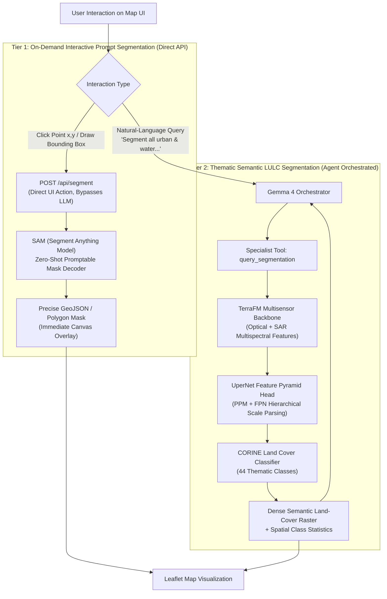

# ADR 0005: Segmentation Architecture — SAM Prompt-Based Masking & TerraFM-UperNet LULC

## Context & Role
Spatial segmentation in SatQuery AI provides pixel-precise boundary delineation of remote-sensing features, serving two operational requirements:
1. **Interactive Prompt-Based Segmentation:** Immediate polygon extraction when a user clicks a point on the map or draws a bounding box over a feature (e.g., a reservoir, airport runway, or building cluster) via `POST /api/segment`.
2. **Dense Thematic Land Use / Land Cover (LULC) Semantic Segmentation:** Comprehensive multi-class semantic segmentation across optical and SAR rasters according to standardized remote-sensing taxonomies (e.g., CORINE 44 classes).

---

## Chosen Architecture: Dual-Tier Decoupled Segmentation

SatQuery AI decouples segmentation into two complementary specialist components, optimizing both interactive user response speed and thematic Earth observation classification accuracy:

---

## Component Details

### 1. Tier 1: Interactive Promptable Masking — SAM (Segment Anything Model)
* **Model:** Segment Anything Model (SAM, Kirillov et al., ICCV 2023).
* **Role:** Powers interactive point/box segmentation in the web UI.
* **Execution Flow:**
  1. The user clicks a coordinate `(point_x, point_y)` or draws a bounding box on the Leaflet map.
  2. The frontend triggers `POST /api/segment` directly, bypassing the agent reasoning loop for sub-second latency ($<300\text{ ms}$ on GPU, $<900\text{ ms}$ on CPU).
  3. SAM evaluates the precomputed image embedding with the spatial prompt, producing a high-resolution binary mask.
  4. The mask is converted to GeoJSON/SVG polygons and displayed immediately on the map canvas.

### 2. Tier 2: Thematic LULC Semantic Segmentation — TerraFM + UperNet
* **Backbone:** **TerraFM** (arXiv:2506.06281) multi-sensor foundation model. Extracts hierarchical multi-scale feature representations from co-registered optical multispectral and SAR backscatter bands.
* **Segmentation Head:** **UperNet** (Unified Perceptual Parsing, Xiao et al., ECCV 2018).
  - Uses a **Pyramid Pooling Module (PPM)** to capture global contextual priors.
  - Employs a **Feature Pyramid Network (FPN)** to fuse multi-resolution features across scales, enabling precise delineation of both fine structures (individual buildings, narrow roads) and broad regional expanses (forests, agricultural fields).
* **Classification Taxonomy:** Fine-tuned on the **CORINE Land Cover (CLC)** dataset:
  - 44 thematic classes spanning a 3-level hierarchy (Urban fabric, Industrial units, Arable land, Permanent crops, Pastures, Forests, Scrub, Wetlands, Water bodies).
* **Multimodal Open-Vocabulary Extension:** Incorporates architectural principles from **MM-OVSeg** (arXiv:2603.17528) to leverage optical–SAR fusion for open-vocabulary segmentation boundaries.

---

## Technical Specifications Summary

| Feature | Tier 1: Interactive Masking | Tier 2: Thematic LULC Segmentation |
|---|---|---|
| **Model** | SAM (ViT-B / ViT-H) | TerraFM + UperNet |
| **Trigger** | Direct UI user click / box | Orchestrator agent query |
| **Input** | Normalized `(x, y)` point or bounding box | Multi-band Optical + SAR GeoTIFF/TIFF |
| **Output** | Binary mask / GeoJSON polygon | Multi-class dense raster + class areas |
| **Taxonomy** | Class-agnostic object boundary | 44 CORINE Land Cover classes |
| **Latency** | $< 300\text{ ms}$ | ~1.5–3.0 s |

---

## References
* **SAM:** Kirillov et al., *"Segment Anything,"* ICCV 2023, arXiv:2304.02643.
* **UperNet:** Xiao et al., *"Unified Perceptual Parsing for Scene Understanding,"* ECCV 2018, arXiv:1807.10221.
* **TerraFM:** MBZUAI, *"TerraFM: An Earth Observation Foundation Model for Multisensor Remote Sensing,"* arXiv:2506.06281, 2025.
* **MM-OVSeg:** *"MM-OVSeg: Multimodal Optical–SAR Fusion for Open-Vocabulary Segmentation in Remote Sensing,"* arXiv:2603.17528, 2026.
* **CORINE Land Cover:** Copernicus Land Monitoring Service (CLMS), European Environment Agency.
